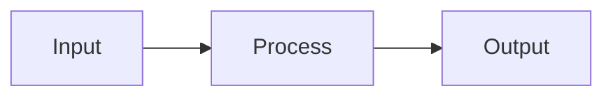

## CSS Variables

Built-in theme variables:

| Variable | Purpose |
| :------- | :------ |
| `--color-deck-gray` | Primary gray for muted text/borders |
| `--text-xs` | Smallest allowed font size |
| `--text-sm` | Small font size |
| `--text-xl` | Large font size |
| `--logos-dark` | URL of dark-variant logo |

**`--bg-gray-5` is NOT built into the theme.** Declare it in frontmatter `style:` before use:

```yaml
style: |
  section {
    --bg-gray-5: color-mix(in srgb, var(--color-deck-gray) 5%, transparent);
  }
```

## Typography

| Class | Use |
| :---- | :-- |
| `.text-xl5` | Hero numbers |
| `.text-xl` | Emphasized terms |
| `.text-sm` | Dense tables, captions |
| `.text-xs` | Fine print only (smallest allowed) |

**Forbidden:** `.text-xs2`, `.text-xs3` — triggers `typography-drift`. Split the slide instead.

## Callouts

```markdown
<div class="note">

Supplementary information.

</div>

<div class="tip">

Helpful tip or shortcut.

</div>

<div class="important">

Critical point that must not be missed.

</div>

<div class="warning">

Something to be cautious about.

</div>

<div class="caution">

Danger — incorrect use may cause problems.

</div>
```

## Figures and Media

```markdown
<figure>

<figcaption>Caption text</figcaption>
</figure>
```

With width control:

```markdown
<figure style="width: 75%;">

<figcaption>Caption</figcaption>
</figure>
```

Video:

```markdown
<figure>
<video src="assets/video/demo.mp4" autoplay loop muted></video>
<figcaption>Demo video</figcaption>
</figure>
```

## Mermaid Diagrams

Wrap in a width-constrained div:

```markdown
<div style="width: 90%">



</div>
```

## Footnotes

Single footnote:

```markdown
Some claim.<sup>[1]</sup>

<div class="footnote">

[1] Author, Title, Venue, Year.

</div>
```

Two-column slide with footnotes — use scoped `.footnote-col`:

```markdown
<style scoped>
.footnote-col {
  font-size: 0.4em;
  color: var(--color-deck-gray);
}
</style>

...slide content...

<div class="footnote-col">

[1] Reference one.
[2] Reference two.

</div>
```

## Summary Box

Requires `--bg-gray-5` declared in frontmatter:

```markdown
<div style="background: var(--bg-gray-5); padding: 0.4em 1em; margin-top: 1em;">

Key takeaway or summary sentence here.

</div>
```

## Scoped Styles

Apply CSS only to the current slide. Place after `---` and comment directives:

```markdown
---

<!-- _header: Section Name -->

<style scoped>
h2 { font-size: 1.2em; }
</style>

## Slide Heading
```

## Inline Emphasis

| Syntax | Renders as |
| :----- | :--------- |
| `**text**` | Bold |
| `*text*` | Italic (colored in lab theme) |
| `_text_` | Italic (alternative) |
| `` `code` `` | Inline code |
