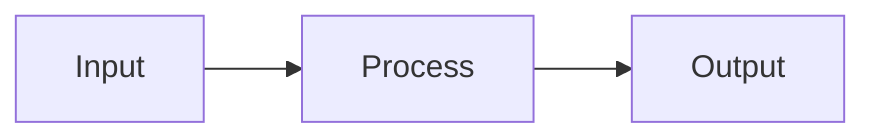

## CSS Variables

Built-in theme variables:

| Variable | Purpose |
| :------- | :------ |
| `--color-deck-gray` | Primary gray for muted text/borders |
| `--text-xs` | Smallest allowed font size |
| `--text-sm` | Small font size |
| `--text-xl` | Large font size |
| `--logos-dark` | URL of dark-variant logo |

**`--bg-gray-5` is NOT built into the theme.** Declare it in frontmatter `style:` before use:

```yaml
style: |
  section {
    --bg-gray-5: color-mix(in srgb, var(--color-deck-gray) 5%, transparent);
  }
```

## Typography

| Class | Use |
| :---- | :-- |
| `.text-xl5` | Hero numbers |
| `.text-xl` | Emphasized terms |
| `.text-sm` | Dense tables, captions |
| `.text-xs` | Fine print only (smallest allowed) |

**Forbidden:** `.text-xs2`, `.text-xs3` — triggers `typography-drift`. Split the slide instead.

## Callouts

Preferred: GitHub-flavored alert syntax. The blockquote is rewritten into the
matching `<div class="…">` callout at render time, so the visual output is
identical to the HTML form below.

```markdown
> [!NOTE]
> Supplementary information.

> [!TIP]
> Helpful tip or shortcut.

> [!IMPORTANT]
> Critical point that must not be missed.

> [!WARNING]
> Something to be cautious about.

> [!CAUTION]
> Danger — incorrect use may cause problems.
```

Rules:

- Type tag must be uppercase (`[!NOTE]`, not `[!note]`) and on the first line of the blockquote.
- The five GFM types above are styled by the theme. Author-defined types (e.g. `[!INFO]`, `[!QUESTION]`) are emitted as `<div class="info">` / `<div class="question">` but have no built-in styling — add rules to `themes/src/_shared/_callouts.css` to use them.
- Callout body text counts toward the validator's body-character and single-line-length budgets (140 chars per line max). Hard-wrap long callout bodies across multiple `> ` lines at sentence boundaries, same rule as ordinary body prose.

Equivalent HTML form (still supported — use when the body contains markdown that
does not survive blockquote escaping, such as nested fenced code):

```markdown
<div class="note">

Supplementary information.

</div>

<div class="tip">

Helpful tip or shortcut.

</div>

<div class="important">

Critical point that must not be missed.

</div>

<div class="warning">

Something to be cautious about.

</div>

<div class="caution">

Danger — incorrect use may cause problems.

</div>
```

## Figures and Media

```markdown
<figure>

<figcaption>Caption text</figcaption>
</figure>
```

With width control:

```markdown
<figure style="width: 75%;">

<figcaption>Caption</figcaption>
</figure>
```

Video:

```markdown
<figure>
<video src="assets/video/demo.mp4" autoplay loop muted></video>
<figcaption>Demo video</figcaption>
</figure>
```

## Mermaid Diagrams

Wrap in a width-constrained div:

````markdown
<div style="width: 90%">


```mermaid
graph LR
    A[Input] --> B[Process] --> C[Output]
```

</div>
````

## Presenter Notes

Add notes visible only in presenter view via HTML comments. Place inside the slide body:

```markdown
<!-- Speaker note: emphasize the funding source before moving on. -->
```

Multiple lines are allowed inside one comment block. Notes do not count toward the validator's body character limits.

## Footnotes

Single footnote:

```markdown
Some claim.<sup>[1]</sup>

<div class="footnote">

[1] Author, Title, Venue, Year.

</div>
```

Two-column slide with footnotes — use scoped `.footnote-col`:

```markdown
<style scoped>
.footnote-col {
  font-size: 0.4em;
  color: var(--color-deck-gray);
}
</style>

...slide content...

<div class="footnote-col">

[1] Reference one.
[2] Reference two.

</div>
```

## Summary Box

Requires `--bg-gray-5` declared in frontmatter:

```markdown
<div style="background: var(--bg-gray-5); padding: 0.4em 1em; margin-top: 1em;">

Key takeaway or summary sentence here.

</div>
```

## Scoped Styles

Apply CSS only to the current slide. Place after `---` and comment directives:

```markdown
---

<!-- _header: Section Name -->

<style scoped>
h2 { font-size: 1.2em; }
</style>

## Slide Heading
```

## Inline Emphasis

| Syntax | Renders as |
| :----- | :--------- |
| `**text**` | Bold |
| `*text*` | Italic (colored in lab theme) |
| `_text_` | Italic (alternative) |
| `` `code` `` | Inline code |

## Japanese Line Breaks

Rendered output runs through Google BudouX at build time. Phrase-boundary
break opportunities (U+200B zero-width spaces) are injected into Japanese
text so long lines wrap at natural phrase points instead of arbitrary
character positions. BudouX also sets `word-break:keep-all` so the browser
only breaks at ZWSP or spaces — long katakana compounds stay intact and
particles like 「は」 start a new line rather than splitting mid-word.
This applies to both the `lab` (slide) and `poster` themes, and is
visible in serve, screenshot, and PDF output.

Do NOT hand-insert `<br>` or `<wbr>` for aesthetic wrapping — BudouX
handles it. Reserve `<br>` for explicit, semantic line breaks (e.g.
address blocks) where you truly want a forced break.

BudouX skips content inside `<code>`, `<pre>`, `<script>`, `<style>`, and
similar tags automatically, so code samples and inline `` `code` `` are
untouched.

To keep a specific run on one line (product names, commands, tightly
coupled phrases), wrap it in `<span class="nobr">…</span>`. The `.nobr`
class applies `white-space: nowrap`, which suppresses BudouX's break
opportunities inside the span.

```markdown
本文の説明に <span class="nobr">Marp Slides</span> と書けば折れません．
```
