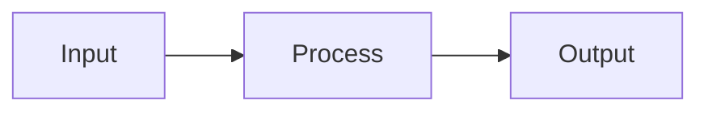
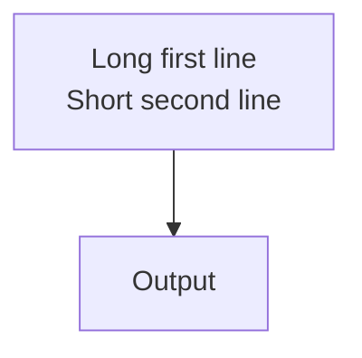

# Figures, video, and Mermaid

Keep media ownership and per-file cross-deck symlinks consistent with repository AGENTS.md. Verify local paths, captions, and source attribution. For PDF output, check a useful static representation of video when the user needs printable content.

## Figures and Media

```markdown
<figure>

<figcaption>Caption text</figcaption>
</figure>
```

With width control:

```markdown
<figure style="width: 75%;">

<figcaption>Caption</figcaption>
</figure>
```

Video:

```markdown
<figure>
<video src="assets/video/demo.mp4" autoplay loop muted></video>
<figcaption>Demo video</figcaption>
</figure>
```

## Mermaid Diagrams

Wrap in a width-constrained div:

````markdown
<div style="width: 90%">



</div>
````

Use `<br/>` or `\n` inside a quoted label when a node label needs a line break:

````markdown

````

Sizing note: Mermaid is laid out before slide CSS is applied. Scoped CSS such
as `.my-flow svg text { font-size: 20px }` changes visible text only and does
not resize node boxes. To make a diagram larger, scale the SVG/container:

````markdown
<div style="width: 90%; --mermaid-width: 115%; --mermaid-max-width: none; --mermaid-overflow: visible">


</div>
````
