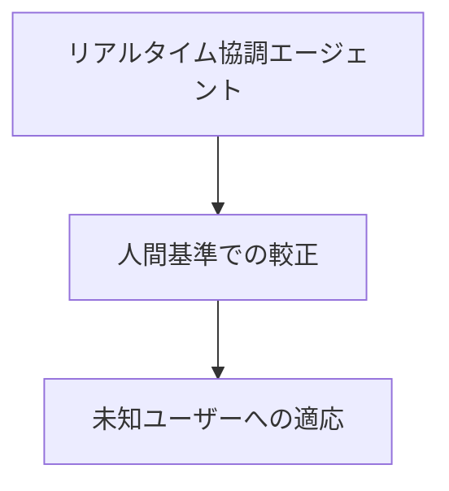
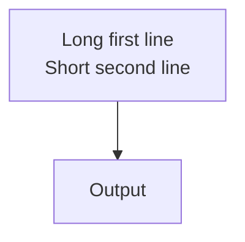

# MarpAgent

Structured slide authoring with Marp + automated validation. Write a brief, generate an outline, author slides in Markdown, and catch overflow before it reaches the audience.

## Overview

```
brief.md → outline.md → slide.md → HTML / PDF / PPTX
```

- **brief.md** — define audience, duration, core message, and required sections
- **outline.md** — auto-generated slide plan with layout hints
- **slide.md** — Marp Markdown using the `lab` theme
- **Validator** — catches overflow, dense bullets, long headings, and font shrinking

## Prerequisites

- Node.js 25.x (pinned by `volta.node` in `package.json`)
- `npm run marpx --` (repo-local CLI script; avoid `npx marpx` in this checkout because the package's own bin is not linked into `node_modules/.bin`)

```bash
npm install
```

## Quick Start

```bash
# 1. Create a deck
npm run marpx -- -n decks/my-talk

# 2. Fill in decks/my-talk/brief.md (8 sections)

# 3. Generate outline
npm run marpx -- decks/my-talk/brief.md --outline

# 4. Author decks/my-talk/slide.md

# 5. Live preview while editing
npm run marpx -- decks/my-talk/slide.md

# 6. Validate
npm run marpx -- decks/my-talk/slide.md -v

# 7. Single-shot preview (optional)
npm run marpx -- decks/my-talk/slide.md -p

# 8. Open thumbnail overview (optional)
npm run marpx -- decks/my-talk/slide.md --overview
```

## Commands

| Command | Description |
| :------ | :---------- |
| `npm run marpx -- -n decks/<path>` | Scaffold a new deck |
| `npm run marpx -- -n decks/<path> --paper` | Scaffold a new A-series paper deck |
| `npm run marpx -- <brief.md> --outline` | Generate outline |
| `npm run marpx -- <brief.md> --outline --output <outline.md>` | Generate outline to an explicit path |
| `npm run marpx -- <slide.md>` | Serve with live reload |
| `npm run marpx -- <slide.md> <page>` | Serve and open at displayed page |
| `npm run marpx -- <slide.md> --screenshot <page>` | Screenshot a slide to `/tmp` |
| `npm run marpx -- <slide.md> -p` | Single-shot preview |
| `npm run marpx -- <slide.md> --overview` | Thumbnail overview |
| `npm run marpx -- <slide.md> --pdf` | Export to PDF |
| `npm run marpx -- <slide.md> --lint` | Lint with deck validator rules |
| `npm run marpx -- <slide.md> --lint --autofix` | Apply safe autofixes, then lint again |
| `npm run marpx -- <slide.md> -v` | Validate |
| `npm run marpx -- <slide.md> -v --strict` | Validate and fail if visual check falls back |
| `npm run marpx -- <slide.md> -v --format sarif` | Emit SARIF JSON for code-scanning pipelines |
| `npm run marpx -- <slide.md> -v --report-dir out/<name>` | Validate with report |
| `npm run marpx -- --doctor` | Run environment diagnostics |
| `npm run marpx -- --theme` | Build all themes |
| `npm run marpx -- --theme lab` | Build a single theme |
| `npm run marpx -- --theme-new <name> --source-url <url>` | Scaffold a new theme |
| `npm run marpx -- --theme -w` | Watch-build themes |
| `npm test` | Run unit tests |
| `npm run quality:gate` | Run unit tests + fixture validation gate |
| `npm run quality:gate:strict` | Enforce visual checks + strict e2e policy |
| `npm run test:e2e` | Run Playwright CLI smoke tests |

## File Structure

```
MarpAgent/
├── decks/              # Your slide decks
│   └── <name>/
│       ├── brief.md
│       ├── outline.md
│       ├── slide.md
│       ├── assets/
│       └── shared -> ../../assets
├── assets/             # Shared assets (logos, fonts)
├── themes/             # Marp entries and surfaces built with Tailwind CSS v4
├── src/                # CLI tools (outline generator, validator)
├── scripts/            # Test runner
└── .agents/skills/     # AI agent authoring skills
```

## Theme

MarpAgent themes are built on Tailwind CSS v4 from design-level `DESIGN.md`
token sources. Available themes:

- `lab` — default research presentation design
- `muji` — quiet, minimal MUJI-inspired design
- `bil` — private Body Integration Learning-inspired design

Common capabilities:

- Five color schemes: Dracula, One Dark Pro, Nord, Neogaia, GitHub Light
- Slide layouts: title, content, two-column
- Callouts: `.note`, `.tip`, `.important`, `.warning`, `.caution`
- Typography scale: `.text-xs` through `.text-xl5`
- Laser pointer effect during presentation
- Mermaid diagram support with MathJax

See `designs/README.md` for the design index, `designs/<name>/DESIGN.md` for
each visual identity, and `docs/theme-contract.md` for the engineering contract
shared by CSS, templates, skills, Tailwind, and the validator.

`designs/<name>/DESIGN.md` is the source of truth for each design's tokens.
`npm run marpx -- --theme` regenerates the matching
`themes/src/_generated/<name>-design-tokens.css` files before compiling the
tracked theme CSS files.

To create another visual identity, start from the scaffold command and then
edit the generated `DESIGN.md` as the token source of truth:

```bash
npm run marpx -- --theme-new <name> --source-url <url> --no-build
```

The scaffold creates `designs/<name>/DESIGN.md`, `themes/src/<name>.css`, and
`fixtures/<name>-slide.md`. The `theme-new` agent skill describes the full
extract-adapt-validate workflow for URL, brand-guide, and existing DESIGN.md
sources.

Use `theme: lab`, `theme: muji`, or `theme: bil` for slide decks and A-series paper layouts.
Canvas size is an explicit frontmatter concern: `16:9`, `4:3`, `a4-portrait`,
`a4-landscape`, or a custom pixel size such as `400x200`. Paper layout is
selected by the `.paper-header` / `.paper-columns` structure, not by a separate
theme or slide class.

### Mermaid sizing

Mermaid diagrams are rendered to SVG before the slide is styled. Changing
`svg text { font-size: ... }` with scoped CSS changes the visible text only;
it does not rerun Mermaid layout, so node boxes and edge routes keep their
original dimensions.

To make a Mermaid diagram larger, scale the rendered SVG/container instead:

````markdown
<div style="width: 90%; --mermaid-width: 115%; --mermaid-max-width: none; --mermaid-overflow: visible">



</div>
````

Use `--mermaid-width`, `--mermaid-max-width`, `--mermaid-max-height`, and
`--mermaid-overflow` on a wrapper when the default diagram size does not fit.
Do not rely on post-render text font-size changes for node sizing.

For node label line breaks, use `<br/>` or `\n` inside a quoted Mermaid label.
Explicit line breaks are measured before layout, so the node box height grows
with the line count and the width follows the longest visual line:

````markdown

````

### Title logo sizing

Title slides default to height-based logo sizing so wide wordmarks remain
legible. Override `--logo-title-background-size` in deck frontmatter only when
you need a different title logo height:

```yaml
style: |
  section {
    --logos-dark: url(shared/logos/haptics_lab/logo_gray.svg);
    --logo-title-background-size: auto 50px;
  }
```

```bash
npm run marpx -- --theme lab   # build theme
npm run marpx -- --theme -w    # watch mode
```

## A-Series Paper Layouts

For dense one-page research outputs, `theme: lab` can render a single A-series
paper canvas instead of a slide sequence.

```bash
# Scaffold a paper deck (A4 portrait)
npm run marpx -- -n decks/my-paper --paper

# Edit decks/my-paper/paper.md, then preview / validate / export
npm run marpx -- decks/my-paper/paper.md        # live preview
npm run marpx -- decks/my-paper/paper.md -v     # validate
npm run marpx -- decks/my-paper/paper.md --pdf  # export PDF for printing
```

- **Portrait:** `size: a4-portrait` in the front matter
- **Landscape:** `size: a4-landscape`
- **Columns:** controlled by the number of `<div class="paper-col">` blocks
  (three for portrait, four for landscape)
- **Cards:** `<section class="paper-section">` with an `## h2` title bar; add
  `highlight` for a key-result card
- Callouts, figures, tables, code, and Mermaid all work inside cards

Export at A4 and scale at print time when a larger physical sheet is needed.
The validator skips the per-slide density heuristics for A-series paper outputs
(a dense full page is expected) but still flags visual overflow. See
`decks/example-paper/paper.md` for a worked example and the `marp-paper` skill
for authoring details.

## AI Agent Usage (Claude Code)

Skills in `.agents/skills/` provide authoring guidance to AI coding agents:

| Skill | Type | Description |
| :---- | :--- | :---------- |
| `marp-slide-types` | reference (auto) | Slide type templates |
| `marp-components` | reference (auto) | Callouts, figures, Mermaid, footnotes |
| `marp-paper` | reference (auto) | A-series paper authoring |
| `marp-validator` | reference (auto) | Validator rules and hard limits |
| `theme-new` | task | Create or adapt a theme from a URL, brand guide, or DESIGN.md |
| `/slide-new <name>` | task | Create a new deck end-to-end |
| `/slide-add <slide.md>` | task | Add slides to an existing deck |
| `/slide-review <name>` | task | Validate and remediate a deck |
| `/paper-new <name>` | task | Create a new A-series paper deck end-to-end |

See `AGENTS.md` for a quick command and directive reference.
