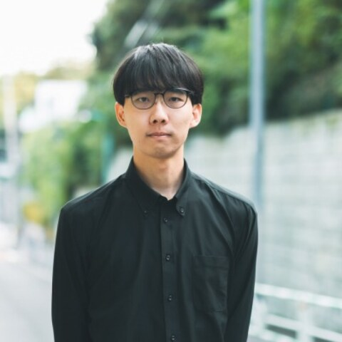
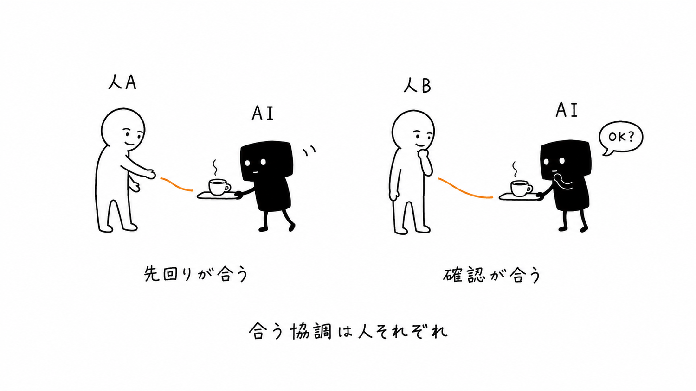
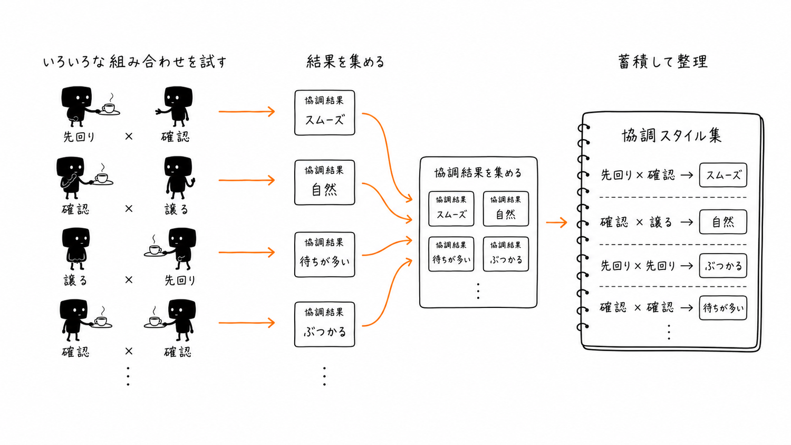
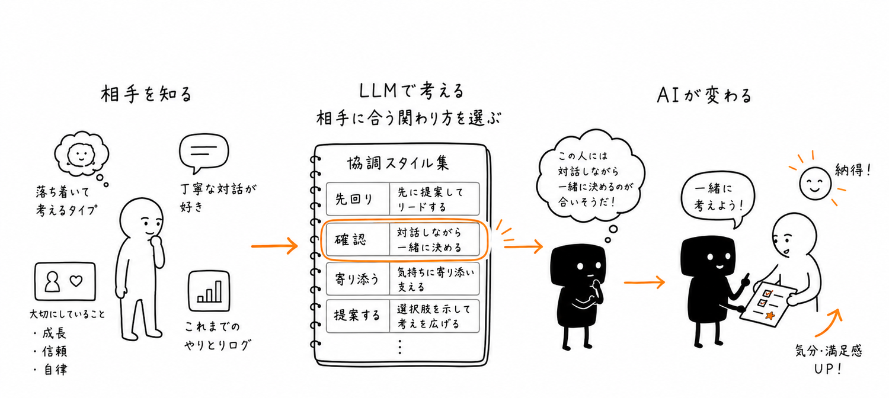

<!-- _paginate: skip -->
<!-- _class: title -->
<!-- _header: 自己PR資料 ／ 2026-06-10 -->

# 意図・感情の推測に基づき 動的に協調する共有操作AIエージェント

名古屋工業大学大学院
触覚学研究室
博士後期3年

**西村 匠生**

---

<!-- _header: 研究背景 -->

## 研究背景 — アバター遠隔就労と「協創」

アバターロボット（OriHime等）は 遠隔就労を実現

- だが業務は**定型中心**で，創造性が課題
- **2人で1台のロボット**を同期GUIで操る 「GUI融合操作」を自作
- カーソル共有で暗黙的な意思疎通・ 操作分担＝**協創**
- 分身ロボットカフェ **DAWN** で 社会実装・実証

<figure class="stack2">

</figure>

---

<!-- _header: 着想 -->

## 着想 — 実証で見えた課題から

実証から2つの課題が見えた

- **課題①** 常時2人で操作 → 運用コスト大
- **課題②** ペア作成が相性依存で属人的

そこで **1人をAIに置き換える**着想に至った

- 相手を気づかうふるまいを **AIにも写し取る**
- 狙いは心的充足 — 支援を控え達成感を促す

<figure style="overflow: hidden;">

</figure>

---

<!-- _header: 提案手法 -->

## エージェントの仕組み — 熟慮と反射の二重過程

「考える層」と「反応する層」を組み合わせる

- **System2（LLM）** — 意図推定・長期計画
- **System1（ファジィ）** — 低遅延で滑らかに操作
- 複数の行動方策を **Choquet** で調停し， 動きの相殺を防ぐ
- 心的状態（意図・感情・性格）を推定し **協調を動的に調整**
- 主体感・納得感・介入頻度で **心的充足を評価**

  
System2 ・ LLM（熟慮）
    
意図推定 ・ 長期方略

  

  
方略 ↓ ／ 状態 ↑

  
System1 ・ ファジィ（反射）
    
FCM 決定 → FIS 実行 → Choquet 調停

  

---

<!-- _header: 今後の展望 -->

## 今後の展望 — 協調スタイルを蓄積する

AI同士の協調を大量に試し， <strong>可解釈な「協調スタイル集」</strong>を蓄積する

- AI同士で多様な組み合わせを **試す**
- 協調結果を **集めて** 可解釈な特性に整理
- 蓄積して **協調スタイル集**（地図）をつくる
- 人との協調データで **較正** し転移を確かめる

単一の正解でなく，多様な協調の地図を描く

<figure>

</figure>

---

<!-- _paginate: skip -->
<!-- _header: まとめ -->

## まとめ — 相手に合わせて適応する

相手に合わせて関わり方を変え， <strong>心地よい協調（Well-being）</strong>を実現する

- 相手の意図・状態を読み取り， **先回り・確認・見守りを切り替える**
- 押し付けず，**人が主体性を保つ協調**
- 人の**暗黙知を取り込むAIエージェント**は， この延長線上にある

<figure>

</figure>

暮らしに近い貴社で，誰かの経験を次の人の力に変えたい

