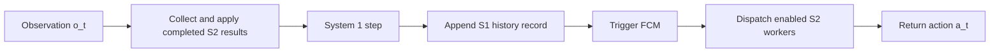
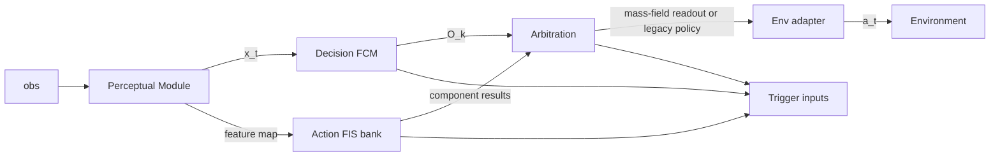

# FuzzyDPT Architecture

Status: 2026-06-17．この文書は論文執筆時の architecture truth として，現行実装の境界と数理表現をまとめる．詳細な設計経緯は [arbitration_module_v3.md](arbitration_module_v3.md)，CoPlace の候補 profile と較正経緯は [system1_design.md](system1_design.md) を参照する．

実装上の真実源は以下である．

| 領域                                    | 実装                                                                                                                     |
| :-------------------------------------- | :----------------------------------------------------------------------------------------------------------------------- |
| runtime order                           | `packages/fuzzy-dpt/src/fuzzy_dpt/_runtime.py`                                                                           |
| System 1 pipeline                       | `packages/fuzzy-dpt/src/fuzzy_dpt/system1/_pipeline.py`                                                                  |
| decision FCM                            | `packages/fuzzy-dpt/src/fuzzy_dpt/system1/fcm/engine.py`                                                                 |
| execution FIS                           | `packages/fuzzy-dpt/src/fuzzy_dpt/system1/fis/engine.py`                                                                 |
| arbitration config types                | `packages/fuzzy-dpt/src/fuzzy_dpt/system1/_arbitration_types.py`                                                         |
| mass-field core                         | `packages/fuzzy-dpt/src/fuzzy_dpt/system1/massfield/`                                                                    |
| CoPlace wiring and realization boundary | `packages/fuzzy-dpt/src/fuzzy_dpt/envs/coplace/_factory.py`, `packages/fuzzy-dpt/src/fuzzy_dpt/envs/coplace/_adapter.py` |

## 1. Overview

FuzzyDPT は Dual Process Theory に基づく認知アーキテクチャであり，graded で解釈可能な System 1 と，必要時にのみ非同期に働く LLM-based System 2 を接続する．System 1 は観測から特徴を作り，FCM で macro-action salience を計算し，各 macro-action に対応する Action FIS が action-space 上の局所的な実行知識を出す．現行の正準経路では，Arbitration はこれらを確率分布へ正規化せず，符号付き非正規化質量場として合成し，stateful readout dynamics によって movement と pulse event を生成する．

このため，論文では現在の主経路を

$$
o_t
\rightarrow \mathbf{x}_t
\rightarrow (O_k(t), \{\psi_k(t)\}_{k=1}^K)
\rightarrow \Psi_t
\rightarrow z_t,\ e_t
\rightarrow a_t
$$

として記述するのが実装に合う．ここで $O_k(t)$ は Decision FCM の macro salience，$\psi_k(t)$ は Action FIS から得る component bipolar mass field，$\Psi_t$ は Choquet 合成後の mass field，$z_t$ は連続 readout state，$e_t$ は pulse firing である．

旧文書で中心に置かれていた

$$
\rho_k(\cdot \mid \mathbf{x}_t),\quad
\Pi_t(\cdot \mid \mathbf{x}_t) \in \mathcal{P}(\mathcal{A})
$$

という確率 policy 表現は，現在も `output_type: proposal` と `output_type: action_space_policy` の互換・ablation 経路として実装されている．しかし，現行の mass-field 経路では正準表現ではない．論文本文で FuzzyDPT の主機構を説明する場合は，probability-simplex 上の mixed strategy ではなく，action space 上の signed unnormalized measure と dynamical readout として書く．

## 2. Runtime Order

1 tick の順序は `FuzzyDPTRuntime.step()` で固定される．



System 2 の完了結果は，その tick の System 1 step より前に適用される．System 1 が action と `System1StepResult` を生成した後，Trigger FCM がその step result から worker activation を判断し，System 2 worker が非同期に dispatch される．したがって System 2 は synchronous controller ではなく，遅延を伴う補助的な推論・誘導・改修機構である．

System 2 が設定される場合，Trigger Module は必須である．これは `FuzzyDPTRuntime` と CoPlace factory の両方で検証される．

## 3. System 1 Pipeline

System 1 の 1 tick は以下の順序で実行される．



System 1 は `FeatureExtractor`，`FCM`，macro-action ごとの `ActionFIS`，`Arbitration`，environment adapter，必要に応じて `MassFieldEngine` を持つ．`mass_field_engine is not None` のとき，通常の proposal decode は通らず，mass-field branch が action を生成する．

## 4. Perceptual Module

Perceptual Module は観測 $o_t$ から同期特徴 $\mathbf{x}_t^s$ を計算し，System 2 Infer worker が有効な場合は inferred feature buffer から非同期特徴 $\mathbf{x}_t^a$ を読む．さらに `actionability_feedback` が有効な profile では，前 tick の execution-layer actionability vector $\mathbf{e}_{t-1}$ を feature schema に追加する．

現行の入力は

$$
\mathbf{x}_t =
\begin{cases}
[\mathbf{x}_t^s;\mathbf{x}_t^a;\mathbf{e}_{t-1}] & \text{actionability feedback on}\\
[\mathbf{x}_t^s;\mathbf{x}_t^a] & \text{otherwise}
\end{cases}
$$

である．feature schema は factory と `System1._validate_feature_schema()` で，FeatureExtractor，InferredFeatures，Action FIS，Decision FCM の node order が一致することを検証する．

Infer worker の結果は `ResultApplier` により `InferredFeatures.update()` へ投入される．inferred feature は request time と arrival time の差，および arrival 後の経過時間に基づき減衰する．

## 5. Decision Module

Decision Module は Time-Delay Leaky Fuzzy Cognitive Map である．入力ノードは $\mathbf{x}_t$ に clamped され，hidden/output nodes は前 tick の最終状態から初期化される．各 iteration $l$ で，hidden/output node $i$ は

$$
A_i^{(l)}
=
(1-\lambda_i)A_i^{(l-1)}
+ \lambda_i
\tanh\!\left(
\beta_i
\sum_j w_{ji} A_j^{(\max(l-1-\tau_{ji},0))}
\right)
$$

により同期更新される．入力ノードは全 iteration で

$$
A_i^{(l)} = x_{t,i}
$$

に固定される．更新は fixed point，limit cycle，または `max_iter` 到達で停止する．最終状態は次 tick へ持続し，短期記憶として働く．

Output node activations

$$
O_k(t)
$$

が macro-action salience の raw signal である．実装は診断用に

$$
\tilde p_k(t)
=
\frac{\exp O_k(t)}{\sum_m \exp O_m(t)}
$$

を計算し，normalized entropy $\bar H(t)$，top-two margin，iteration flip count $n_{\mathrm{flip}}$，convergence iterations $l_{\mathrm{end}}$ を出す．mass-field branch では $\tilde p_k$ は主合成の重みではなく，trigger-facing diagnostics と `D_act` 算出に使われる．

S2 Steer worker の出力は preference bias

$$
\hat O_k(t) = O_k(t) + \alpha \tilde b_k
$$

として Decision output に加法的に注入される．

## 6. Execution Module

Execution Module は macro-action ごとの `ActionFIS` bank である．各 rule $r$ は antecedent membership と local policy consequent を持つ．実装は 2 種類の量を同時に保持する．

1. legacy policy path 用の normalized firing strength．これは product T-norm の rule weight $w_{k,r}$ を正規化して component policy を作る．
2. mass-field path 用の unnormalized truth degree と polarity．truth degree は antecedent memberships の Gödel min

$$
\tau_{k,r}(\mathbf{x}_t)
=
\min_{l \in \mathcal{L}_{k,r}}
\mu_{k,r,l}(x_{t,l})
$$

であり，polarity $\sigma_{k,r}$ は local policy の assertion/denial を表す．

Action FIS は rule-local distribution $q_{k,r}$ を generator から生成する．現行 generator は Dirac，Gaussian，Categorical，Product，CoPlace-specific typed/toward generator などを含む．macro-action $k$ の component policy result は，coverage $C_k$，contradiction $V_k$，rule-local policies，および legacy component distribution を保持する．

mass-field branch では，component field は

$$
\psi_k(\cdot \mid \mathbf{x}_t)
=
\sum_{r=1}^{R_k}
\sigma_{k,r}\,
\tau_{k,r}(\mathbf{x}_t)\,
q_{k,r}(\cdot \mid \mathbf{x}_t)
\in \mathcal{M}(\mathcal{A})
$$

として解釈される．ここで $\mathcal{M}(\mathcal{A})$ は action space 上の signed unnormalized particle measure である．この式では rule weights を $\sum_r w_{k,r}$ で割らない．absolute mass scale が WHEN information を運ぶため，probability normalization は入れない．

`component_mass_field()` は local distribution を粒子に分解し，各粒子に

$$
m_{k,r,n}
=
\sigma_{k,r}\tau_{k,r}p_{k,r,n}
$$

を割り当てる．continuous distribution は代表点として mean particle を使い，readout 側の kernel が spatial smoothing を担う．

## 7. Arbitration Output Types

`ArbitrationConfig.output_type` は次の 3 値を持つ．

| output_type           | 状態            | 概要                                                                                                       |
| :-------------------- | :-------------- | :--------------------------------------------------------------------------------------------------------- |
| `mass_field`          | 現行正準経路    | signed component fields を 2-additive capacity で Sipos Choquet 合成し，readout dynamics で action を出す  |
| `proposal`            | legacy/ablation | component policies を Choquet score で proposal particles にし，adapter decode strategy で action へ落とす |
| `action_space_policy` | legacy/ablation | ActionSpacePolicyParams を融合し，adapter が policy mean/sample を実行する                                 |

この文書の以降は `mass_field` を主対象にする．旧 proposal path では `guarded_choquet_bayes`，`potential_basin_mean`，`direct_action_readout` などの decode strategy が残るが，それらは現在の主張を支える正準 readout ではない．

## 8. Mass-Field Arbitration

### 8.1 Bipolar Mass Field

`BipolarMassField` は

$$
\psi
=
\sum_{n=1}^N m_n \delta_{a_n},
\qquad
a_n \in \mathcal{A},\quad m_n \in \mathbb{R}
$$

を表す．実装フィールドは以下である．

| field         | meaning                                     |
| :------------ | :------------------------------------------ |
| `actions`     | particle positions，shape `(N, action_dim)` |
| `masses`      | signed unnormalized masses，shape `(N,)`    |
| `strata`      | action stratum id per particle              |
| `class_order` | environment-supplied stable stratum names   |

正質量は assertion，負質量は knowledge-level aversion/denial を表す．物理的に実行不能な action の hard rejection はこの層ではなく environment boundary の責務である．

### 8.2 Capacity Construction

Mass-field arbitration は bias-injected Decision activations $\hat O_k$ から 2-additive Möbius capacity を作る．`salience_temperature` が設定されている場合，singleton base は fixed-temperature softmax

$$
m_k^{base}
=
\frac{\exp(\hat O_k/T_s)}
{\sum_j \exp(\hat O_j/T_s)}
$$

である．設定されていない場合は rectified salience

$$
m_k^{base}
=
\frac{\max(\hat O_k,0)}
{\sum_j \max(\hat O_j,0)}
$$

を用いる．全 macro が非正である場合は uniform singleton に fallback する．これは action を決めるための no-op fallback ではない．field mass が弱ければ readout state が自然に rest へ減衰する．

pair interaction は `interaction_budget > 0` の場合のみ有効になる．compatibility $\chi_{ij} \in [-1,1]$ は，caller から渡される online compatibility matrix，または `interactions:` block から compile された static compatibility matrix である．raw pair target は

$$
b_{ij}^{(0)}
=
\beta_I\,
r_{ij}(m_i^{base},m_j^{base})\,
\chi_{ij}
$$

であり，$r_{ij}$ は `product_2`，`product`，`min`，`geometric_mean`，`none` から選ぶ．

最終 capacity は

$$
\mu(A)
=
\sum_{i\in A}m_i
+ \sum_{\{i,j\}\subseteq A}m_{ij}
$$

で表され，以下を満たすように projection される．

$$
\sum_i m_i + \sum_{i<j}m_{ij}=1
$$

$$
m_i + \sum_{j\in S}m_{ij} \ge 0
\qquad
\forall i,\quad
S\subseteq \mathcal{K}\setminus\{i\}
$$

$$
\sum_{i<j}|m_{ij}| \le \beta_I
$$

実装は SLSQP projection を試し，Scipy unavailable，solver failure，component count limit 超過の場合は deterministic shrink projection に fallback する．sweep-scale profile では `projection_qp_max_components: 0` により shrink projection を明示的に使うことがある．

### 8.3 Sipos Choquet Composition

component field $\psi_k$ は正部 $\psi_k^+$ と負部 $\psi_k^-$ に分け，同じ capacity で別々に 2-additive Choquet score を評価して差を取る．union support 上の粒子 $a$ について

$$
C_\mu(f^\pm)(a)
=
\sum_i m_i f_i^\pm(a)
+ \sum_{i<j}m_{ij}\min(f_i^\pm(a),f_j^\pm(a))
$$

であり，

$$
\Psi_t(a)
=
C_\mu(f^+)(a) - C_\mu(f^-)(a)
$$

を合成 field の signed mass とする．実装は component particle supports を stratum と action coordinate で merge し，各 union particle 上でこの式を計算する．合成 mass は clip しない．負 mass は readout へ aversion として渡される．

## 9. Dynamical Readout

Mass-field branch では，composed field $\Psi_t$ をすぐに argmax/MAP decode しない．`MassFieldEffector` が stateful readout dynamics を 1 tick 進め，continuous movement と pulse firing を返す．

### 9.1 Continuous Strata

continuous readout state $z_t$ は Gaussian-smoothed signed field 上の damped gradient flow で更新される．実装式は

$$
z
\leftarrow
(1-\rho)z
+ \frac{\lambda}{\sigma^2}
\sum_n
m_n K_\sigma(\|a_n-z\|)(a_n-z)
$$

である．負質量は repulsion として働く．local attractive mass が `starvation_mass` を下回ると，`sigma * far_multiplier` の wide kernel を混ぜ，locally starved mode から遠方の強い cluster へ soft に escape できる．`readout_substeps` は同じ連続力学を Euler substeps で細かく積分し，coarse-step の numerical limit cycle を避ける．

CoPlace の mass-field stratum では continuous dims は `(0, 1)` であり，movement flow に寄与するのは `no_click` stratum の粒子である．`click` stratum の連続座標は click の位置条件を表すだけで，movement desire として再利用しない．

emission law は readout state を action command へ変換する．`emission_speed_ref > 0` の場合，

$$
s
=
\min\left(1,\left(\frac{\|z\|}{r}\right)^\gamma\right)
$$

により speed を決め，deadband 内では zero movement を出す．これは commitment state と actuator command を分けるための transfer curve であり，dpt-agent との moving-speed parity を扱う calibration dial でもある．

### 9.2 Pulse Strata

pulse stratum $c$ ごとに leaky integrate-and-fire state $u_c$ を持つ．stratum net mass

$$
M_c(t)
=
\sum_{n: c_n=c} m_n
$$

に対して

$$
u_c
\leftarrow
(1-\lambda_u)u_c + g_u M_c(t)
$$

を更新し，

$$
u_c \ge 1
$$

で pulse を発火する．発火後は `pulse_reset` へ reset される．minimum sustainable firing mass は

$$
M_{\min} = \frac{\lambda_u}{g_u}
$$

であり，これは crisp truth gate の dynamical successor である．入力 mass 自体は low-pass filtering しない．leak は membrane potential にだけかかる．

## 10. Environment Boundary

Environment adapter は action-space の型構造と最終 realization を担当する．CoPlace mass-field branch では

```python
MASS_FIELD_CLASS_ORDER = ("no_click", "click")
MASS_FIELD_CONTINUOUS_DIMS = (0, 1)
MASS_FIELD_PULSE_STRATA = ("click",)
```

であり，`mass_field_stratum(action)` は click dimension が 0.5 を超えるかどうかで stratum を決める．

`realize_mass_field(movement, fired, obs)` は readout の movement を `[-1,1]` に clip し，`max_step * cursor_movement_scale` によって environment の pixel-scale action へ変換する．pulse firing は binary click dimension に写像される．この経路では proposal decode の `guarded_choquet_bayes` や class-MAP filtering は使わない．click cooldown や button validity の物理的な帰結は environment boundary 側に残り，agent 内部では click desire と movement desire を同じ field/readout 契約で扱う．

旧 proposal path では `convert_proposal()` が guard-aware MAP，class-conditional mean，potential-basin variants，direct action readout などを持つ．これは `mass_field` branch の realization boundary とは別系統である．

## 11. Trigger Module

Trigger Module は S1 内部指標を single-step leaky FCM へ入れ，System 2 workers の urgency と trigger decision を出す．`fcm_trigger.yaml` の構造的不変条件は以下である．

- all edge delays are zero
- `iteration.max_iter == 1`
- output nodes correspond to `steer`，`infer`，`revise`
- worker thresholds and cooldowns are wrapper config として管理される

現行 Trigger FCM の normalized inputs は

| metric              | source                          | normalization                                 |
| :------------------ | :------------------------------ | :-------------------------------------------- |
| $\bar H$            | Decision FCM entropy            | $2\bar H - 1$                                 |
| $D_{\mathrm{act}}$  | Arbitration diagnostic          | $\min(2D_{\mathrm{act}}/D_{\mathrm{ub}}-1,1)$ |
| $C_{\min}$          | Execution FIS coverage          | $\min(2C_{\min}/C_{\mathrm{ub}}-1,1)$         |
| $V_{\max}$          | Execution FIS contradiction     | $\min(2V_{\max}/V_{\mathrm{ub}}-1,1)$         |
| $n_{\mathrm{flip}}$ | Decision iteration flips        | $2n_{\mathrm{flip}}/L-1$                      |
| $l_{\mathrm{end}}$  | Decision convergence iterations | $2l_{\mathrm{end}}/L-1$                       |
| $\Delta t_w$        | worker dispatch history         | $2\tanh(\Delta t_w/\tau_{\mathrm{ref}})-1$    |

`TriggerInputs` には mass-field branch の cross-layer dissonance

$$
D_{\mathrm{DE}}
=
\max(C1,\max_c C2_c)
$$

も保持される．現行 `fcm_trigger.yaml` と `TriggerFCM._normalize()` はまだ $D_{\mathrm{DE}}$ を FCM input vector へ入れていない．したがって論文で current implementation として書く場合，$D_{\mathrm{DE}}$ は recorded diagnostic / future trigger input であり，現在の worker activation の直接入力ではない，と区別する．

## 12. System 2

System 2 は optional な非同期 worker set であり，runtime の外側から S1 を直接 step しない．`System2.dispatch_workers()` は Trigger FCM の decision が true で，かつ同名 worker が実行中でない場合だけ worker を thread pool に submit する．

| worker | result         | S1 への適用                                                                            |
| :----- | :------------- | :------------------------------------------------------------------------------------- |
| Infer  | `InferResult`  | inferred feature buffer を更新する                                                     |
| Steer  | `SteerResult`  | preference bias $(\tilde{\mathbf{b}},\alpha)$ を設定する                               |
| Revise | `ReviseResult` | decision / trigger / execution target に対する validated CaP or patch を hot-swap する |

Revise target は `decision`，`trigger`，`execution:<macro_action>` のように target-local に扱われる．S2 result は history に記録され，次回以降の snapshot と prompt context に反映される．

## 13. Cross-Layer Consistency

Mass-field branch では Decision salience と Execution field の整合性を runtime diagnostic として計算する．

Decision が salience を割り当てた macro-action の component field に十分な asserted mass がない場合，

$$
C1
=
\sum_k A_k(1-E_k),
\qquad
E_k=\tanh(2\|\psi_k^+\|)
$$

が大きくなる．また pulse stratum では，single component が plainly actionable な assertion を持つにもかかわらず composed net mass が firing boundary を下回る場合，

$$
C2_c
=
S_c\max\left(0,1-\frac{M_c}{M_{\min}}\right)
$$

が大きくなる．実装は $D_{\mathrm{DE}}=\max(C1,\max_c C2_c)$ を `MassFieldStepResult.d_de` として出し，`System1StepResult.trigger_inputs` に含める．

`actionability_feedback` はこれとは別の bottom-up feedback arc である．有効時には execution-layer positive field norm から macro ごとの feasibility を作り，次 tick の FCM input feature に注入する．`absolute` mode は floor 付きの absolute feasibility，`relative` mode は mean-centered differential feasibility を使う．現行の mainline comparison candidate では，この arc は net-negative と診断され，`noaf` が主経路である．

## 14. CoPlace Instantiation

CoPlace factory は architecture を task instance に接続する．主な責務は以下である．

- environment config から feature schema と activation curves を作る
- inferred feature schema がある場合は FCM input schema を拡張する
- actionability feedback が有効な場合は macro-action ごとの `actionability_*` feature を追加する
- FCM decision config と FIS execution config を ball/goal 数に合わせて展開する
- CoPlace compatibility kernel を構築する
- `output_type: mass_field` の場合は `MassFieldEngine` を構築し，System 1 に注入する
- System 2 config がある場合は System 2 と Trigger FCM を構築する

CoPlace 固有の知識，たとえば button layout，click radius，cursor movement scale，ball/goal feature expansion，partner-direction/grip-deference features はこの instantiation 層に閉じ込める．architecture の一般記述では，これらを FuzzyDPT 全体の前提として扱わない．

## 15. Paper-Writing Invariants

論文でこの文書を下敷きにする際は，以下を守る．

- FuzzyDPT の主経路を probability policy mixture として書かない．現行正準経路は signed unnormalized mass field と dynamical readout である．
- Margin-adaptive softmax，reliability salience gating，class-MAP decode，fixed no-op proposal を主機構として書かない．それらは legacy proposal path または過去の補償機構である．
- System 2 を synchronous planner として書かない．S1 が毎 tick action を出し，S2 は Trigger FCM により非同期 dispatch され，結果は後続 tick に適用される．
- CoPlace の button，grip，ball，partner feature は実験 instantiation の話であり，architecture 本体の一般性とは分ける．
- `D_{\mathrm{DE}}` は current code では recorded diagnostic であり，現行 Trigger FCM input vector にはまだ含まれていない．
- `output_type: proposal` と `output_type: action_space_policy` は実装に残るが，paper の main method では `output_type: mass_field` を中心に説明する．
