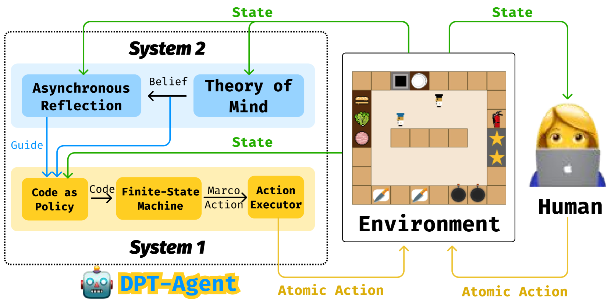
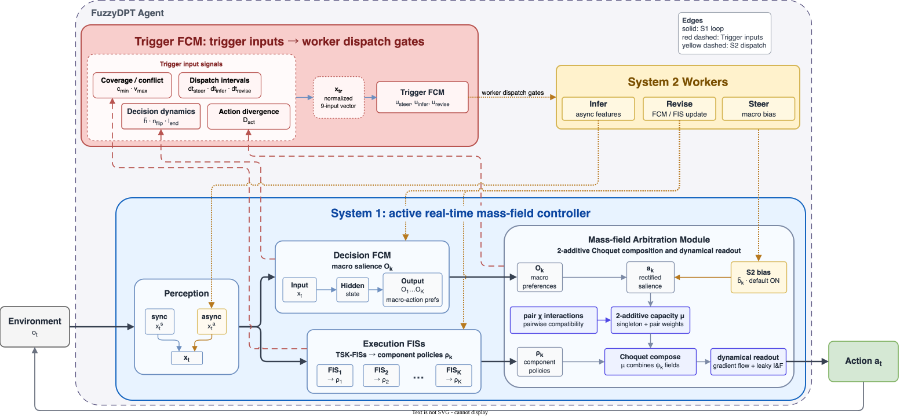
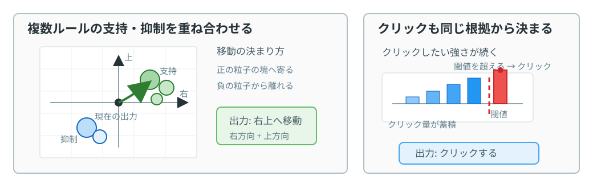
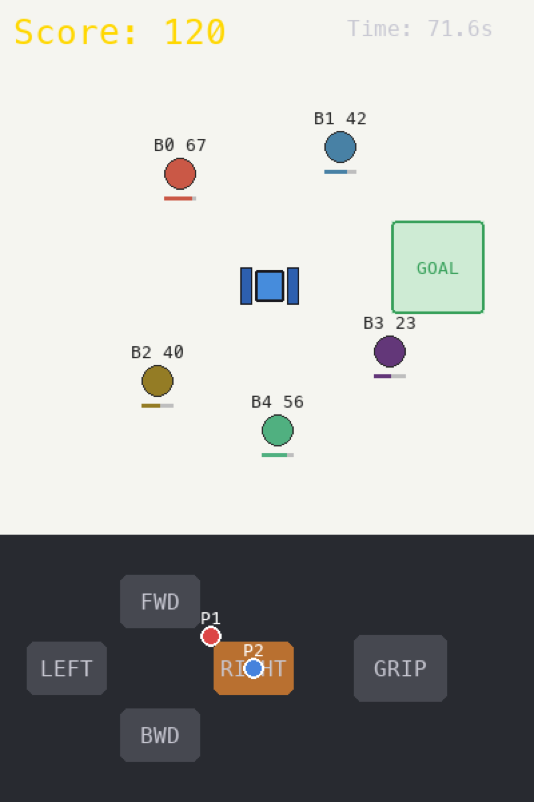
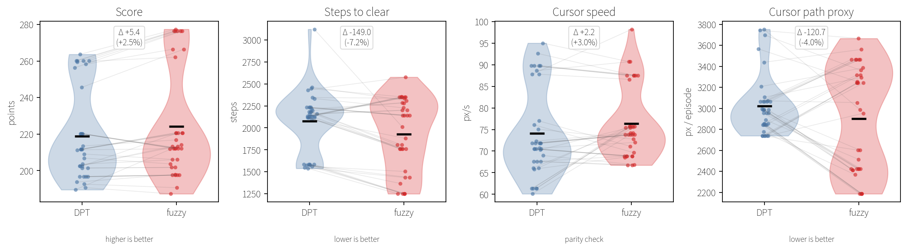
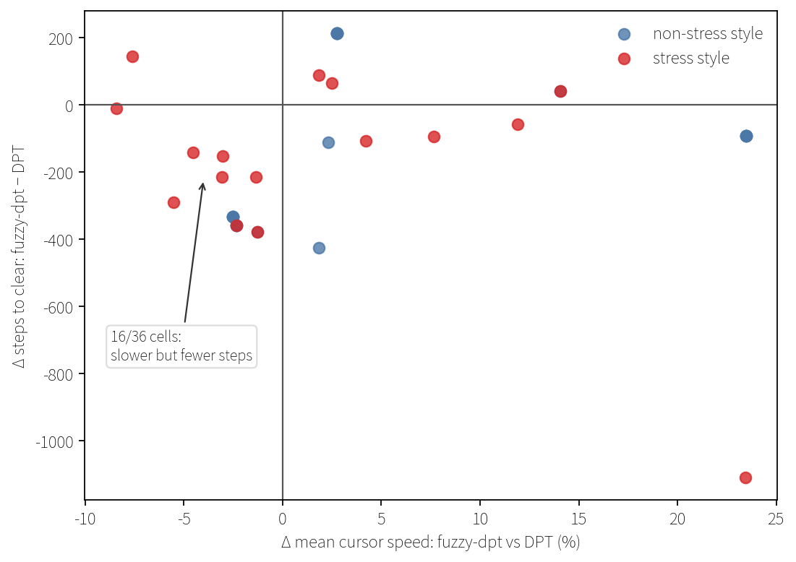
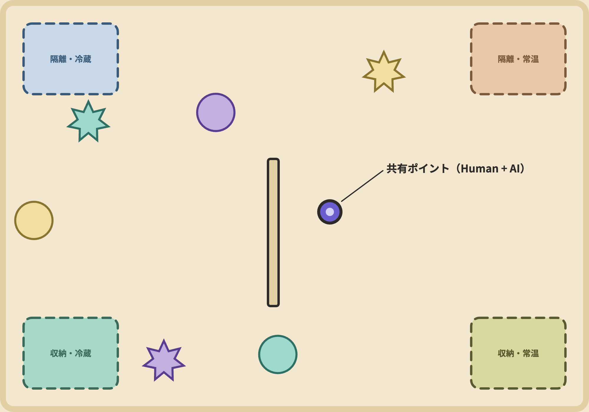
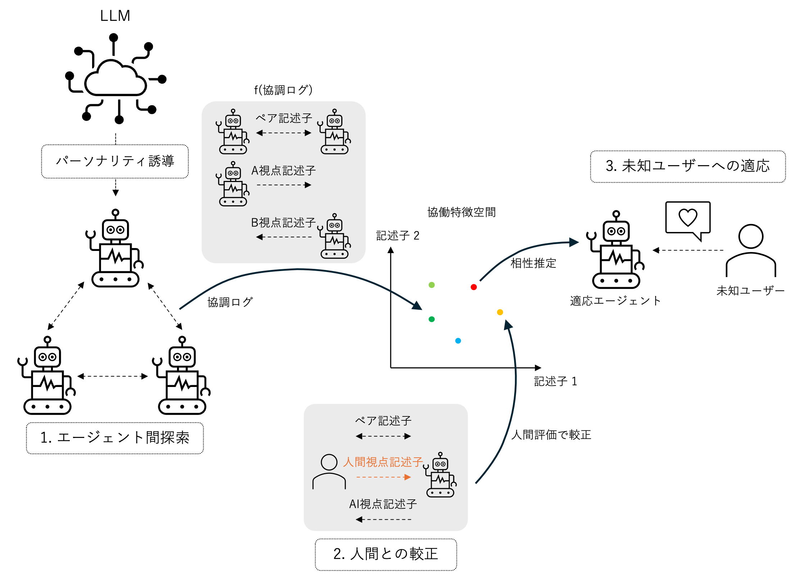

<!-- _header: 背景と目的 -->

## アバターロボット共有操作と AI 協調の課題

- **アバターロボット共有操作**： 2人が GUI でロボットを共有操作． AI エージェントがパートナーとして参加  → 人間に応じた協調が必要
- **DPT (Dual Process Theory)**： System 1（高速行動生成）と System 2（LLM 熟慮）を分離するアーキテクチャ
- 既存 DPT-Agent の限界： S1 は **FSM の離散状態切替 + ハードコード実行**で連続的な変動に追従できない．S2 は周期起動でコストが高い

**目的**: 共有操作で人間と自然に協調する AI を実現
**提案**: DPT 各層をファジィ化した **FuzzyDPT**

<figure>

</figure>

<figure style="margin-top: 1em">

<figcaption>先行研究（DPT-Agent）のアーキテクチャ</figcaption>
</figure>

---

<!-- _header: 提案手法 -->

## 構成要素：ファジィに基づく 3 つの処理

**ファジィ理論**: 状態を「0か1」で切り分けず，「どの程度そうか」を0〜1で扱う理論

| 要素              | 役割                       | 入力 → 出力       | DPT-Agent      |
| ----------------- | -------------------------- | ----------------- | -------------- |
| **FCM**           | マクロ行動の重要度を更新   | 状態 → 重要度     | FSM            |
| **FIS**（TSK 型） | ルールごとの判断材料を計算 | 状態 → 行動の根拠 | ハードコード   |
| **Arbitration**   | 支持・抑制を合成して読む   | 根拠群 → 行動     | （なし・新規） |

- **FCM**: 状態やマクロ行動間の因果関係を重み付きネットワークで表現し，各マクロ行動の重要度を連続的に更新する
- **FIS**: 「もし〜なら」形式のルールに基づき，どの行動を支持・抑制するかを計算する
- **Arbitration**: ルールから出た支持・抑制を重ね合わせ，最終的な移動とクリックを出す

---

<!-- _header: 提案手法 -->

## FuzzyDPT-Agent アーキテクチャ

<figure style="margin: 0; max-width: 100%; max-height: 100%;">

</figure>

### Trigger FCM

S1 内部指標から S2 起動を判断  → 周期起動より効率的に熟慮を投入

### S2 Workers（非同期LLM）

- **Infer**: パートナー特性・意図を推定  → FCM 入力に追加
- **Steer**: 選好バイアスを提案  → Decision FCM 出力に加算
- **Revise**: 知識構造の更新を提案  → FCM/FIS を置き換え

---

<!-- _header: 提案手法 -->

## 行動決定：複数のルールを重ねて 1 つの行動にする

<figure>

</figure>

「どれか 1 つの状態を選ぶ」のではなく， 複数ルールの支持・抑制を同時に残したまま重ね合わせる．
その合成結果から，毎時点の移動ベクトルとクリック発火を決める．

---

<!-- _header: 実験 -->

## "CoPlace" 共有操作タスク

<figure style="margin-top: 1em; text-align:center;">
  
  <figcaption>共有カーソルでボールを運ぶ協調課題</figcaption>
</figure>

**タスク**: 2 プレイヤーがカーソルを共有操作し， ボールをゴールまで運ぶ．ボールスコアは時間で減少する

**条件**: DPT / FuzzyDPT（w/o S1）

**設計**

- パートナーは優先度スコアが最大のボールを選ぶ

- 9 パートナースタイル: (α，β，γ) を変えて， 通常 5 種とストレス 4 種を作る
- カーソル速度を統制する

---

<!-- _header: 実験結果 -->

## 結果: 成功率は同じ，差は協調効率に出た

<figure style="margin: 0.15em 0 0;">

<figcaption>DPT と FuzzyDPT の主要指標．黒線は平均，点は各条件，薄線は同じ乱数条件とスタイルの対応</figcaption>
</figure>

<strong>36/36</strong>
両条件で全クリア

<strong>−149 ステップ</strong>
完了までの平均差

<strong>+5.4 点</strong>
残時間差が得点差へ

全条件で成功したうえで，FuzzyDPT は少ないステップで完了した． 差は成否ではなく，協調中の進め方に出ている．

---

<!-- _header: 実験結果 -->

## 速度差だけでは完了時間の差を説明できない

<figure class="main-figure">

<figcaption>速度差とステップ数差の対応</figcaption>
</figure>

<strong>+3.0%</strong>
平均速度差

<strong>−7.2%</strong>
ステップ数差

<strong>16/36</strong>
遅いのに少ステップ

FuzzyDPT の改善は，カーソルを速く動かしただけでは説明しきれない． 同じ速度帯でも，より少ないステップで終わる条件がある．

---

<!-- _header: 今後の方針 -->

## 今後の方針: Contextual Co-Embodiment

**問い**: 人間と AI が **身体融合**するとき，**LLM** で意図推定する AI は「**動きを邪魔する別主体**」でなく「**共に身体を動かす共主体 (we-agency)**」になるか

<figure style="margin: 0;">

<figcaption>共有ポイントで 6 物体を 4 zone に仕分け</figcaption>
</figure>

AI (**FuzzyDPT**)：S2 LLM が人間意図を推論し S1 をリアルタイム適応

- **Neutral**: AI なし（単独操作の基準）
- **Naive**: S1 のみ（適応なし）
- **Cooperative**: S1 + S2（適応あり）

**情報非対称の協調設計**： 共有ポイント v_shared = 0.5 (v_human + v_agent) を両者が操作

- 4 zone = 隔離/収納（行）× 冷蔵/常温（列）
- **人間** 形状→行（Bouba/Kiki 直感）／**AI** 色→列（センサ DB）
- 単独では不可 → 共有身体での意味統合が必須

---

<!-- _header: 今後の方針 -->

## 今後の方針: LLM 協調行動特性空間

<figure>

<figcaption>協調ログ → 協働特徴空間 → 人間較正 → 未知ユーザー適応</figcaption>
</figure>

**中心問い**  
LLM 同士の協調ログから得た協働特徴空間は，人間との較正を通じて，未知ユーザーに合う協調エージェントの設計・選択に使えるか

**3 段階の方針**

1. **探索**: パーソナリティ誘導により多様なエージェント設計を生成し，協調ログから特徴を抽出
2. **較正**: 人間との協調ログ・主観評価により，特徴空間の意味を補正
3. **適応**: 未知ユーザーの短い協働ログから，相性を推定しエージェントを調整

<!--**主張階層**
**C1** 特徴が行動差を捉える
→ **C2** 合成協調から人間協調へ測定が転移する
→ **C3** 較正済み特徴空間により適合パートナーを選択できる-->

<!------->

<!-- _paginate: skip -->
<!-- _header: まとめ -->
<!--

1. **FuzzyDPT**: 質量場と動的読み出しによる連続的な S1 と，S2 LLM Worker による非同期の意図推定と誘導
2. **S1 評価**: 全体優位ではないが，ストレス条件でのターゲット選択特性の差が一貫して残る
3. **次段階 1**: Co-Embodiment で S2 込みの人間と AI の共有身体実験（実装進行中）
4. **次段階 2**: LLM 協調行動特性空間で合成から人間への測定の転移を検証

-->
