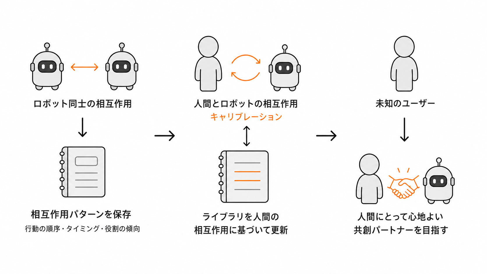
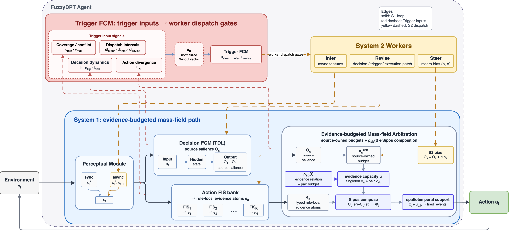
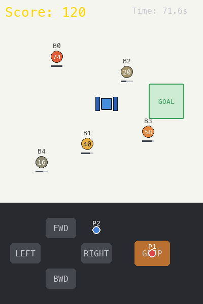

<!-- _paginate: skip -->
<!-- _class: title -->
<!-- _header: NEC 研究インターン面談 ／ 2026-06-26 ／ テーマ 01-02 -->

# 相互作用記述子に基づく 協働エージェントの設計と適応

名古屋工業大学大学院
触覚学研究室
博士後期 3 年

**西村 匠生**

<!--
今から，私の研究である「相互作用記述子に基づく協働エージェントの設計と適応」についてお話しします．

私は，遠隔操作ロボットや協働タスクを対象に，人と人，または人とエージェントの協調がどのように変わるのかを研究しています．

特に，個人の能力や性格だけを見るのではなく，誰と，どの状況で協働するかによって生じる違いを扱いたいと考えています．

この考え方と，インターンテーマの人体姿勢予測の接点，そして研究経験をどのように活かしたいかを説明します．
-->

---

<!-- _header: 研究背景 -->

## アバターロボットを用いた遠隔協調就労

<strong>遠隔就労の到達点</strong>アバターロボットにより，飲食店接客やオフィス受付を遠隔から担える．

<strong>残る制約</strong>上肢操作が難しい場合，細かい調整や長時間操作が負担になる．

<strong>提案した仕組み</strong>2 人の操作者の GUI 操作を融合し，1 台のロボットへ送る．

<strong>実証実験</strong>DAWN カフェで，6 名がパンケーキトッピングを 短期 1 日・長期 9 日間で実施した．

<strong>次の展開</strong>人的コストや相性問題を踏まえ，片方の操作者を AI エージェントに 置き換える．

<figure>
  

    
  

  <figcaption>アバターロボットが働く DAWN カフェ</figcaption>
</figure>

<figure>
  
  <figcaption>共有操作システムの概要</figcaption>
</figure>

<!--
背景として，アバターロボットを用いた遠隔協調就労があります．

アバターロボットを使うと，飲食店の接客やオフィス受付のような業務を遠隔から担えます．

一方で，1 人が 1 台のロボットを操作する形式では，身体操作の制約がそのまま作業範囲の制約になります．

例えば，上肢操作が難しい場合には，細かい位置合わせや長時間の操作が負担になります．

現場側から見ると，ロボットの台数や操作できる人員が限られるため，操作の分担と融合が重要になります．

そこで，2 人の操作者の GUI 操作を融合し，1 台のロボットへ送る共有操作システムを提案しました．

実証実験では，DAWN カフェで 6 名がパンケーキトッピングを行い，短期 1 日と長期 9 日間の条件で協調を観察しました．

ただし，人同士の共有操作をそのまま広げると，操作者を常に 2 人確保する人的コストが残ります．

また，誰と組むかによって協調のしやすさが変わるなら，相性問題も実運用上の制約になります．

そこで次の展開として，片方の操作者を AI エージェントに置き換えることを考えています．
-->

---

<!-- _header: 観察 -->

## パートナーによって変化する協調

- DAWN 長期就労実験では，複数ペアが同じ トッピング課題に取り組んだ
- トッピング工程の進め方は，ペアごとに異なるパターンとして現れた
- クリック頻度と介入タイミングも，ペア構成に応じて変わる
- 他者との一体感や作業中の幸福感といった 主観評価にも差が出る

**協調は個体の性質だけでなく， 組み合わせで変わる**

<figure>

<figcaption>ペアの組み合わせによる協調パターンの差異</figcaption>
</figure>

<!--
このスライドでは，その観察を示しています．

DAWN の長期就労実験では，複数のペアが同じトッピング課題に取り組みました．

しかし，工程の進め方，クリック頻度，介入するタイミングは，ペアによって異なるパターンとして現れました．

右の図は，工程間の遷移や操作の偏りが，ペアごとに違って見えることを示しています．

同じ作業でも，どの工程に長く留まるか，どの工程へ移りやすいかがペアによって変わることがわかります．

ここで重要なのは，この違いは単に「操作がうまい人」と「そうでない人」の違いではないという点です．

同じ人でも，相手が変わると協調の仕方が変わる可能性があります．

さらに，他者との一体感や作業中の幸福感といった主観評価にも差が出ます．

そのため，協調は個体の性質だけでなく，組み合わせで変わるものとして捉える必要があります．
-->

---

<!-- _header: 研究方針 -->

## 相互作用記述子の発見・較正と適応

- 問い：なぜ協調はパートナーで変わるのか
- 対象：人間・エージェント・文脈の**組み合わせ**
- 表現：組み合わせから生じる協調の違いを **相互作用記述子**として扱う
- 目的：記述子を発見・較正し，未知の人間に合う協調様式へ適応する

個人差の推定ではなく， 組み合わせで生じる協調様式を扱う

<figure>

</figure>

<!--
この観察から，私の研究では，相互作用記述子という考え方を置いています．

問いは，なぜ協調がパートナーによって変わるのか，です．

対象にしているのは，人間，エージェント，文脈の組み合わせです．

ここでいう記述子は，個人差を一方的に推定するためのラベルではなく，

組み合わせから生じる協調の違いを，エージェントが扱える特徴として表すものです．

例えば，相手が積極的に介入するタイプなのか，待つタイプなのかだけでなく，どの局面でその傾向が出るのかを表す必要があります．

その記述があれば，エージェントは常に同じ支援をするのではなく，相手と状況に応じて介入の強さやタイミングを変えられます．

研究の流れとしては，まず協調の違いを発見し，次に人間との相互作用で較正し，最後に未知の人間に合う協調様式へ適応させることを目指しています．

この枠組みによって，人に合わせるエージェントを，単なる平均的な振る舞いではなく，相手との関係に応じて変わるものとして設計したいと考えています．
-->

---

<!-- _header: 実装機構 -->

## 協働エージェント FuzzyDPT-Agent

<figure class="agent-figure">

</figure>

<strong>目的</strong>共有操作の片方を AI エージェントが担い， 相手に応じて行動を調整する．

<strong>設計</strong>Dual Process Theory (DPT) に基づき， 高速な S1 と非同期な LLM の S2 を連携させる．

<strong>ファジィ制御</strong>状況と行動を連続値で扱い，判断根拠をルールとして読める．

<!--
その実装機構として，FuzzyDPT-Agent を開発しています．

目的は，共有操作の片方を AI エージェントが担い，人間の相手に応じて行動をリアルタイムに調整することです．

DPT は Dual Process Theory の略で，人の認知を高速で直感的な System 1 と，低速で熟慮的な System 2 に分けて捉える考え方です．

この考え方に基づき，FuzzyDPT-Agent では，高速に動く System 1 と，非同期に判断を補助する System 2 を分けています．

System 1 は，ファジィ制御を使って，状況と行動を連続値で扱います．

これにより，離散的な if 文だけでは表しにくい中間的な状態や，あいまいな介入の強さを扱えます．

協働タスクでは，「今は介入すべきか，譲るべきか」が明確に二値で決まらない場面が多くあります．

そのため，距離，速度，相手の入力，停滞のような量を連続的に扱えることが重要です．

また，判断根拠をルールとして読めるため，なぜその行動になったのかを後から確認しやすくなります．

System 2 は，LLM を用いて推論，見直し，方針調整を非同期に行います．

リアルタイム性が必要な部分は System 1 で保ちつつ，より大きな文脈の見直しを System 2 に任せる構成です．
-->

---

<!-- _header: 評価環境 -->

## 相手に応じた行動調整を CoPlace で評価する

<strong>CoPlace</strong> は，2 者が共有ハンドを GUI で同時に操作し，ボールを掴んでゴールへ 運ぶ協働タスク．

<strong>相手で変わる</strong>操作傾向に応じて，介入や譲歩が変わるか

<strong>局面で変わる</strong>接近・把持・運搬・投入で，主導と補助が切り替わるか

<strong>記述子で捉える</strong>相手と局面に応じた違いを，適応に使える特徴として表せるか

相手と局面で変わる協調を，相互作用記述子として扱う．

<figure>
    
<figcaption>CoPlace: 共有ハンドによる把持・運搬タスク</figcaption>
</figure>

<!--
このアーキテクチャを評価するために，CoPlace という協働タスクを使います．

CoPlace は，2 者が共有ハンドを GUI で同時に操作し，ボールを掴んでゴールへ運ぶタスクです．

ここで見たいのは，エージェントが単にタスクを完了できるかだけではありません．

相手によって行動調整が変わるか，局面によって主導と補助の役割が変わるか，その違いを記述子として扱えるかを見ます．

「相手で変わる」は，操作傾向の違いに応じて，介入や譲歩の仕方が変わるかを見る観点です．

「局面で変わる」は，接近，把持，運搬，投入のように，タスク内の局面によって必要な協調が変わるかを見る観点です．

相手と局面を分ける理由は，協調の違いが，ペアに固有の傾向だけでなく，タスクのどの場面にいるかにも依存するからです．

具体的な指標としては，同方向入力と逆方向入力，介入の密度，停滞時間，局面ごとの主導権の移り変わりを候補にしています．

最終的には，この違いを相互作用記述子として表し，未知の相手への適応に使えるかを評価したいと考えています．
-->

---

<!-- _header: テーマ 01-02 との接続 -->

## 人体姿勢予測に対する貢献可能性

### (8)人体姿勢予測 を選ぶ理由

- (8) では，映像から人の未来 3D 姿勢を予測する
- ロボットがいる環境では，人の未来動作は 接近・譲り合い・回避に左右される
- 博士研究で扱ってきた，人・ロボット相互作用の 観察と評価が活きる

### 研究経験を活かせる点

- 実装：PyTorch / HuggingFace でモデルを理解・実装する
- 実験：人とロボットが関わる予測場面を設計する
- 評価：関節誤差に加え，自然さや受容性を見る

モデル機構の直結ではなく，予測場面の設計と評価で貢献する．

映像入力 過去の姿勢

ロボット・環境条件 接近・譲り合い・回避

↓

未来 3D 姿勢を予測

↓

客観評価 関節誤差・到達精度

主観評価 自然さ・心理的受容性

<!--
次に，今回のテーマとの接続についてです．

私は，サブテーマ8の人体姿勢予測に興味があります．

このテーマが良いと考えている理由は，人とロボットが関わる環境で人の未来の動きを予測する問題意識が，博士研究と重なるからです．

特に，ロボットが近くにいる環境では，人の未来動作は本人の意図だけでは決まりません．

ロボットの接近，譲り合い，回避，受け入れのような要素が，人の動き方に影響します．

私の研究経験を活かせるのは，相互作用のある場面を設計し，観察し，評価する部分です．

このような場面では，モデルの出力を関節誤差だけで見ると，人にとって自然か，ロボットの振る舞いとして受け入れやすいかを取りこぼす可能性があります．

そのため，予測場面をどう設計するか，どの評価指標を組み合わせるか，どのような主観評価を入れるかが重要になります．

私はこれまで，主観評価設計，人とロボットが関わる実験設計，PyTorch や HuggingFace を用いた実装を扱ってきました．

これらの経験を，姿勢予測モデルの実装理解と評価設計の両面で活かしたいと考えています．
-->

---

<!-- _header: まとめ -->

## 相互作用の評価経験を姿勢予測に活かす

観察

<strong>パートナーで協調が変わる</strong>

同じシステムでも，ペアの組み合わせで操作と主観評価が変わった．

問い

<strong>相互作用記述子をモデル化する</strong>

人間・エージェント・文脈の組み合わせから，適応に使える記述子を作る．

貢献

<strong>人体姿勢予測に評価観点を加える</strong>

(8) 人体姿勢予測 では，予測場面の設計と評価に研究経験を活かせる．

01-02 では，予測モデルの実装に加え，
相互作用条件を扱う評価設計の観点で貢献したい

<!--
まとめです．

私の研究では，パートナーによって協調が変わるという観察から出発しています．

そこから，人間，エージェント，文脈の組み合わせで生じる違いを，相互作用記述子としてモデル化しようとしています．

この考え方は，サブテーマ 8の人体姿勢予測における評価設計と問題設定に活かせます．

そのため，このテーマは私の研究経験を活かしやすく，インターンで取り組みたいテーマだと考えています．

インターンでは，予測モデルの実装に加えて，相互作用条件を扱う評価設計の観点でも貢献したいと考えています．

本日は以上です．

ご清聴ありがとうございました．
-->
