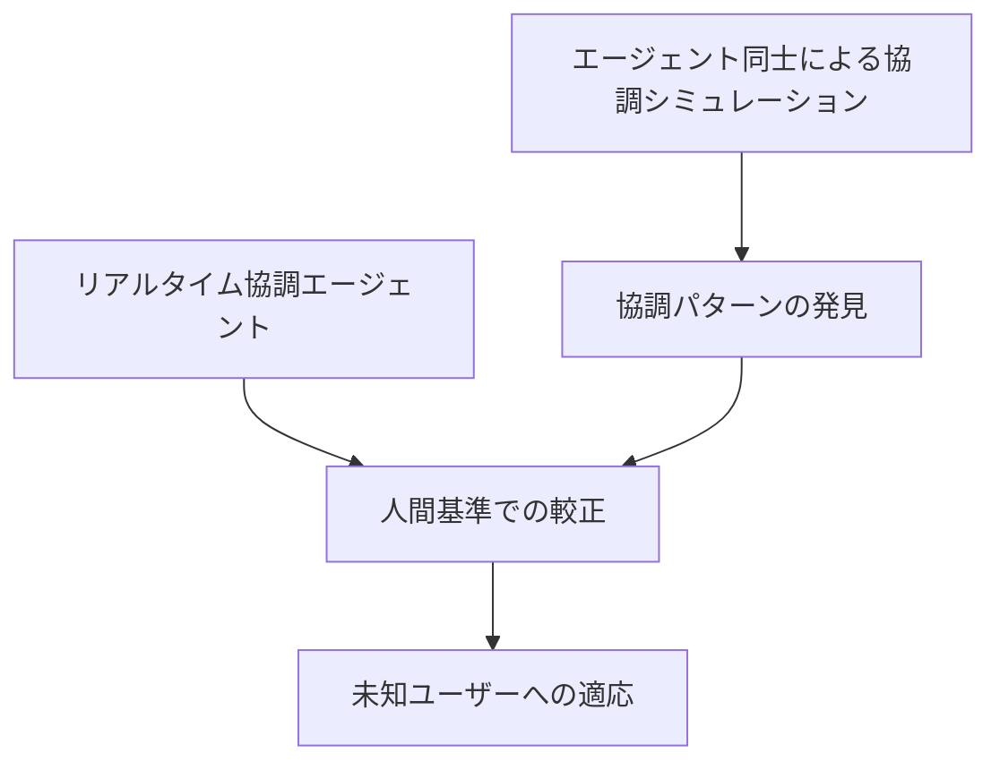
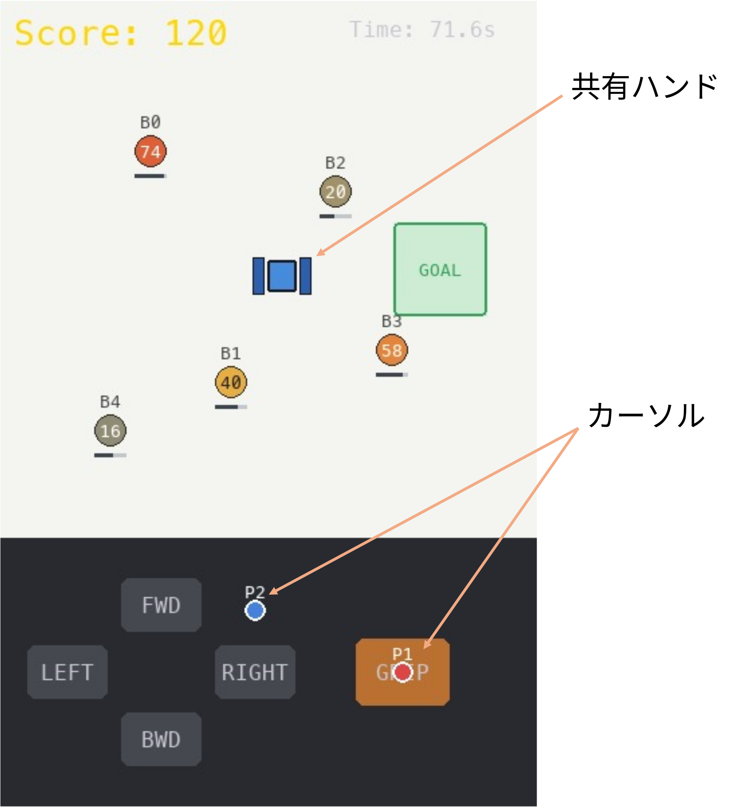
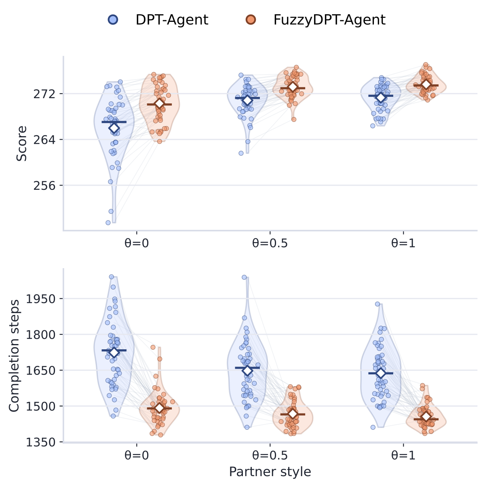

<!-- _paginate: skip -->
<!-- _class: title -->
<!-- _header: 富士通 インターンシップ面接 2026-07-06 -->

# 人の心的充足を目指した 協調 AI エージェント

<figure>

</figure>

名古屋工業大学
工学専攻 博士後期課程
触覚学研究室

西村 匠生

---

<!-- _header: 問題意識 -->

## 相手によって協調は変化する

- **2人が同時に1台のロボットを共有操作**
  → *身体障害者同士*によるトッピング接客就労実証を主導
- 協働の中で，経験や個性を活かした関わり方が表れる
    - **相手によって自己発揮の仕方が変わる**

- 一方で，関わり方のずれは対立や遅延につながる
  → 人間同士の協働を， **人間–AI 協調操作**へ拡張したい

<figure>

</figure>

<figure style="margin-top: 1em;">
<video src="shared/video/融合アバター共創実験_プロジェクトストーリー_JP.mp4" muted autoplay controls loop></video>
</figure>

---

<!-- _header: 研究課題 -->

## 協調 AI の構築から未知ユーザー適応へ

着眼点

- 相手や場面によって，相互作用や感じ方が変化する
- その変化に応じて，**リアルタイムに協調の仕方を調整**する必要がある

研究課題

- リアルタイムに推論し協調するエージェントアーキテクチャを構築
- 協調パターンを人間基準で較正
- 未知ユーザーへの適応方針を設計

---

<!-- _header: リアルタイム協調エージェント FuzzyDPT -->

<figure class="arch-figure">

</figure>

目的

- _人間とリアルタイムに協調操作する_
- 譲歩・発揮などの**スタイルを状況に応じて変化**させる

アプローチ

- **ファジィ制御**で低遅延に柔軟な行動生成
- _必要な場面で_ LLM を起動

---

<!-- _header: リアルタイム協調エージェント FuzzyDPT -->

<figure>

</figure>

<figure>

</figure>

比較条件

- 2人の入力で，1つのハンドをGUIで共有操作
- パートナー 3スタイル： 「近さ」or「価値」
- 比較対象：DPT-Agent（w/o System 2）

結果

- FuzzyDPT はパートナースタイルに依らず高得点の傾向
- 完了ステップ数は少ない傾向

ファジィ化により**協調行動を連続的に調整**できた可能性

---

<!-- _header: 協調様式の獲得 -->

## 人に合う協調様式を獲得する

協調様式の探索
→
人間基準での較正
→
未知ユーザーへの適応

<figure class="flow-figure">

</figure>

---

<!-- _header: 富士通インターンへの接続 -->

## インターンへの取り組み

- 共有操作の研究
    - _意図が見えない介入は，学習者の主体感を損なう_
    - カーソル表示により，教師の意図を手がかりとして提示

- Self-Evolving Agent への展開
    - EVE-Agent は，根拠付きの自己進化を実現
    - 一方で，根拠へ至る探索過程の誘導は弱い
    - 正解や根拠を直接与えず，*検索方針・注目点などをヒント*として提示する？

共有操作で培った「複数主体の意図を分析し，協調を支援する設計」の視点を活かし，自己進化マルチエージェントの協調・学習・評価に貢献したい

