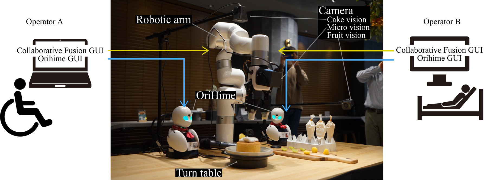
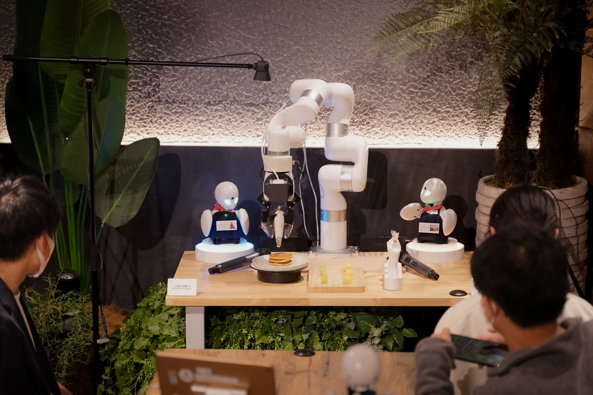
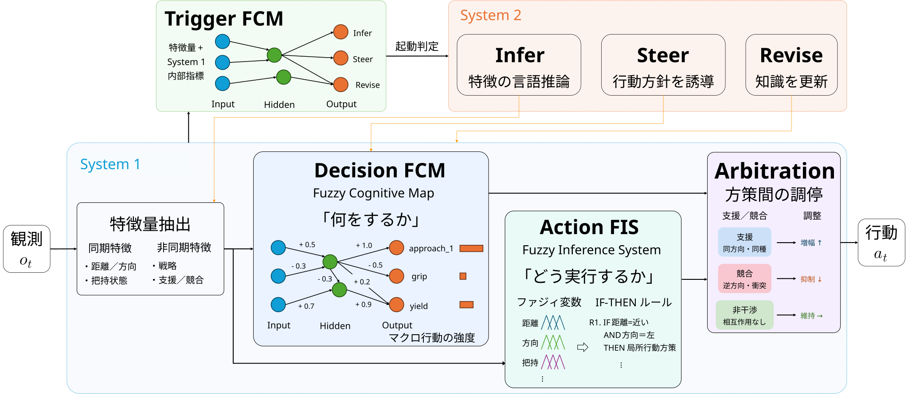
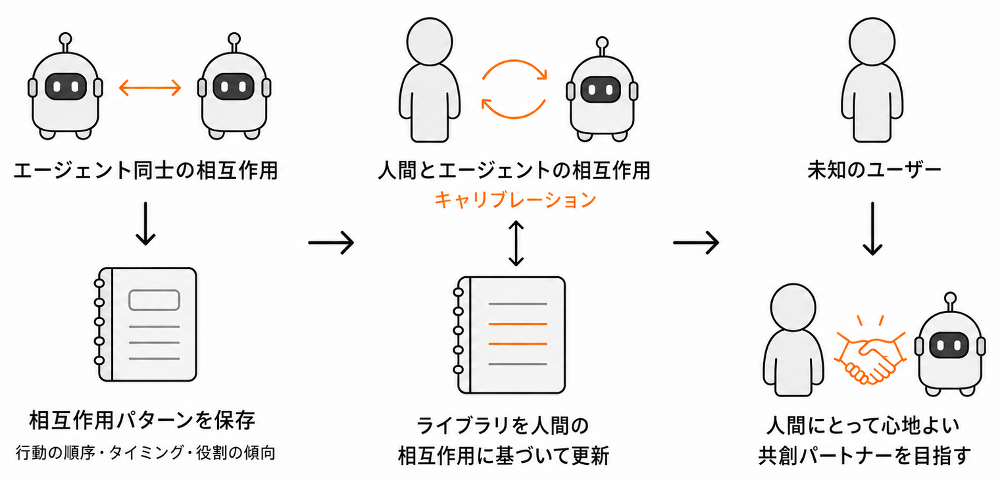

<!-- _paginate: skip -->
<!-- _class: title -->
<!-- _header: 2026-07-10 -->

# 人に寄り添う協調 AI エージェント 設計と初期結果

<figure>

</figure>

KDDI 総合研究所 インターンシップ面接

名古屋工業大学大学院 触覚学研究室 D3

<strong style="font-size: 1.45em;">西村 匠生</strong>

---

<!-- _header: 原点 -->

## 納得して関われる協調相手を設計する

実装

- **2 名が同時に 1 台のロボットを共有操作**
  - 同期 GUI で入力を統合し，遠隔就労を支援

現場で見えたこと

- カフェ接客・トッピング実証を実施
- 役割分担，譲り合い，経験に応じた関わり方が表れた

次の問い

- 強すぎる介入は，関与感を下げる
- 相手や状況に応じて関わり方を調整する AI へ

<figure class="visual-card">

</figure>

<figure class="visual-card">

</figure>

---

<!-- _header: 研究の問い -->

## 相手に応じて関わり方を変える AI

同じタスクでも，相手や場面によって協調の現れ方は変わる．

<strong>意図</strong>
<ul>
<li>操作状況を見る</li>
<li>相手の狙いを推定する</li>
</ul>

<strong>介入</strong>
<ul>
<li>支援する / 待つ / 譲る</li>
<li>強さとタイミングを調整する</li>
</ul>

<strong>関与感</strong>
<ul>
<li>タスク達成だけで終わらせない</li>
<li>自分も関われた感覚を保つ</li>
</ul>

<ol class="timeline">
<li><strong>状況を読む</strong></li>
<li><strong>意図を推定する</strong></li>
<li><strong>介入を調整する</strong></li>
<li><strong>関わり方を整える</strong></li>
</ol>

- タスク達成だけでなく，関与感を保つ
- 相手と場面に応じて，協調様式を変える

---

<!-- _header: 現在の研究 -->

## リアルタイム協調のための FuzzyDPT-Agent

<ul class="research-lead">
<li>固定ルールだけでは，曖昧な協調が硬い</li>
<li>LLM 単独では，リアルタイム操作に遅い</li>
</ul>

機構: どう動くか

<figure>

</figure>

<ul>
<li><strong>System 1</strong>: 距離・方向・把持状態で行動を調整</li>
<li><strong>System 2</strong>: 必要時に状況理解・方針を補助</li>
</ul>

初期結果: 何が見えているか

<figure>

</figure>

<ul>
<li><strong>読み取り</strong>: 高 score / 低 steps の傾向</li>
<li>速度差や未検証範囲は注意点として扱う</li>
</ul>

---

<!-- _header: 方向性 -->

## 人に合う協調様式を獲得する

探索
→
較正
→
適応

候補を広げる

関わり方を更新

相手へ近づける

<figure class="flow-figure">

</figure>

<ul>
<li>固定した支援者ではなく，関わり方を更新し続ける</li>
<li>未知ユーザーに合う共創パートナーを目指す</li>
</ul>

---

<!-- _header: KDDI コース 6 への接続 -->

## フィジカル AI と人に寄り添う AI エージェントへ

フィジカル AI
人に寄り添う AI エージェント
調査 → 仮説 → 実験 → 報告

<strong>実装接続</strong>
動く系に落とす
<ul>
<li>LLM・ファジィ推論を接続</li>
<li>GUI 協調環境で試す</li>
</ul>

<strong>協調モデル化</strong>
寄り添いを操作可能にする
<ul>
<li>介入の強さを扱う</li>
<li>タイミング・主導権配分を扱う</li>
</ul>

<strong>研究展開</strong>
仮説を実験へ戻す
<ul>
<li>観察ログと応答設計をつなぐ</li>
<li>短いプロトタイプで検証する</li>
</ul>

<ul>
<li>人が納得して関われる協調設計を持ち込む</li>
<li>KDDI 総研の AI エージェント研究で深めたい</li>
</ul>

