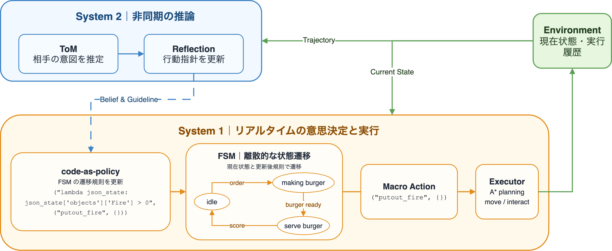

## DPT-Agent：熟慮的推論をリアルタイム実行へ接続する

<figure>

</figure>

---

## 提案手法（FuzzyDPT-Agent）

### 課題感

- 既存の System 1 は，マクロ行動を離散的に選択する．
- 既存の System 2 は，周期的に介入する．

### 目的

**人間と AI が同一環境を共有操作する状況で，リアルタイムの協調と方針変化への適応を両立する．**

### 着目点・アプローチ

- _ファジィ表現で，マクロ行動の選好と競合を連続的に扱う．_
- System 1 が常時，連続的に行動を生成する．
- System 1 の内部不確実性から，System 2 の介入要否を判断する．
- System 2 は文脈補完・戦略調整・知識改訂を選択的に行う．

---

## FuzzyDPT-Agent

<figure>

</figure>

---

## 共有マニフェストが比較条件を統制する

**共有マニフェスト**

両実行系が参照する知識構造を，一つに定義する．
語彙 ・ 選択関係 ・ 実行規則 ・ マクロ行動の定義

  
↓ <strong>型検証・中間表現</strong>

  
共有マニフェスト一式を検証し，各実行系のコンパイラへ渡す．

**DPT-Agent**

ファジィ適合度を 0.5 で二値化し，離散的な FSM と実行器を構成

**FuzzyDPT-Agent**

連続値の RBFCM ・ 実行 FIS ・ 調停器を構成

実験開始時には知識を揃え，実行系固有の計算様式を比較する．

