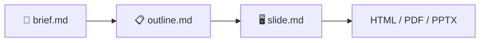
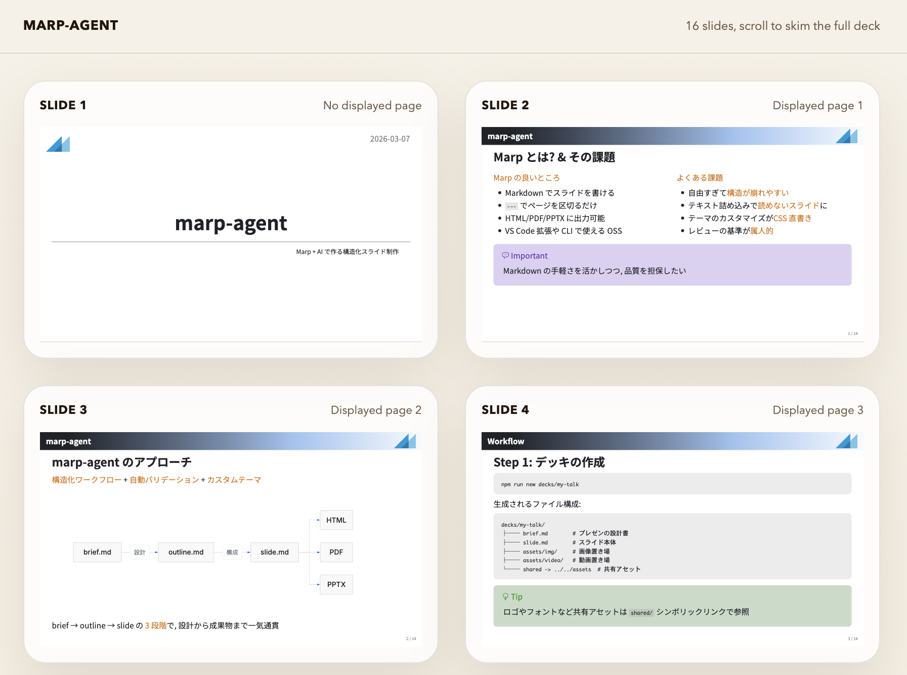

<!-- _paginate: skip -->
<!-- _class: title -->
<!-- _header: 2026-04-07 -->

# MarpAgent

<div class="author">

Markdown で作る, 構造化プレゼンテーション

</div>

---

<!-- _header: Agenda -->

<div class="centered">

1. MarpAgent とは
2. 構造化ワークフロー
3. Lab テーマ
4. プレゼンモード & バリデーション
5. AI アシスト & 始め方

</div>

---

<!-- _header: MarpAgent とは -->

## MarpAgent とは

Markdown だけでスライドを作成・検証できるプラットフォーム

- **Marp** ベースの Markdown → スライド変換エンジン
- **構造化ワークフロー**で構成の破綻を防止
- **自動バリデーション**で表示崩れを本番前に検出
- HTML / PDF / PPTX へのエクスポートに対応

<div class="tip">

VS Code 拡張やCLIで使える OSS ツール

</div>

---

<!-- _header: ワークフロー -->

## 構造化ワークフロー

brief → outline → slide の3段階でスライドを作成する

<div style="width: 90%">



</div>

- **brief.md** — 対象者, 時間, 核心メッセージ, 禁止パターンを定義
- **outline.md** — brief からスライド構成を自動生成
- **slide.md** — Markdown でスライドを執筆, バリデーション

---

<!-- _header: テーマ -->

## Lab テーマ

<div class="col">
<div>

**カラースキーム (5種)**

- Dracula / One Dark Pro
- Nord / Neogaia
- GitHub Light

**レイアウト**

- title / content / two-column

</div>
<div>

**組み込みコンポーネント**

- コールアウト (note / tip / warning ...)
- Mermaid ダイアグラム & MathJax 数式
- コードハイライト

</div>
</div>

---

<!-- _header: プレゼンモード -->

## プレゼンモード

<div class="col">
<div>

**発表を支援する機能**

- レーザーポインタ (オレンジカーソル + グロー)
- ライブリロードで編集即反映
- オーバービューモードで全体把握

</div>
<div>

<figure>

<figcaption>レーザーポインタ付きプレゼンモード</figcaption>
</figure>

</div>
</div>

---

<!-- _header: バリデーション -->

## 自動バリデーション

<div class="col">
<div>

**Headless ブラウザで検出**

- オーバーフロー (はみ出し) 検出
- 密集バレット (5個超) の警告
- 長すぎる見出しの検出
- フォント縮小の防止

CI/CD 統合で品質ゲートとして利用可能

</div>
<div>

<figure>

<figcaption>オーバービューで全スライドを一覧</figcaption>
</figure>

</div>
</div>

---

<!-- _header: AI 統合 -->

## AI アシスト

Claude Code スキルで brief 作成からバリデーション修正まで自動化

- **`/slide-new`** — デッキの新規作成 (brief → outline → slide を一気通貫)
- **`/slide-add`** — 既存デッキへのスライド追加
- **`/slide-review`** — バリデーション実行と自動修正

<div class="important">

AIがワークフロー全体をアシストするため, Markdown の記法を覚えるだけで始められる

</div>

---

<!-- _header: 始め方 -->

## 始め方

3つのコマンドで今すぐ始められる

```bash
# 1. デッキを作成
npx marpx -n decks/my-talk

# 2. brief を埋めてアウトラインを生成
npx marpx decks/my-talk/brief.md --outline

# 3. スライドを書いてバリデーション
npx marpx decks/my-talk/slide.md -v
```

<div class="tip">

ライブプレビューは `npx marpx <slide.md>`, 単発 preview は `npx marpx <slide.md> -p`, overview は `npx marpx <slide.md> --overview` で起動

</div>

---

<!-- _paginate: skip -->
<!-- _header: まとめ -->

<div class="centered">

1. **Markdown だけ**で高品質なスライドを作成
2. **brief → outline → slide** で構成の破綻を防止
3. **自動バリデーション**で表示崩れを事前に検出
4. **AI アシスト**でワークフロー全体を効率化

</div>
