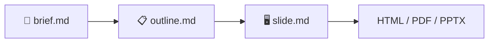
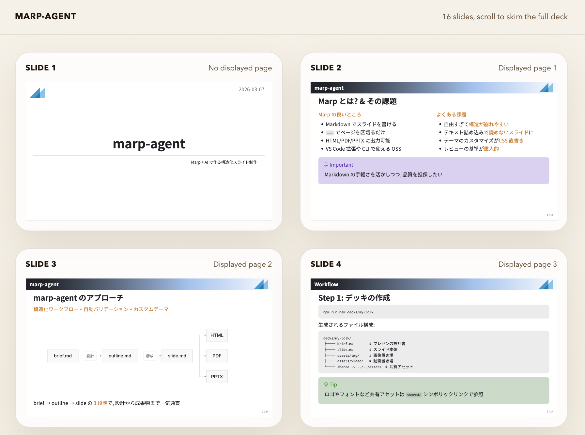
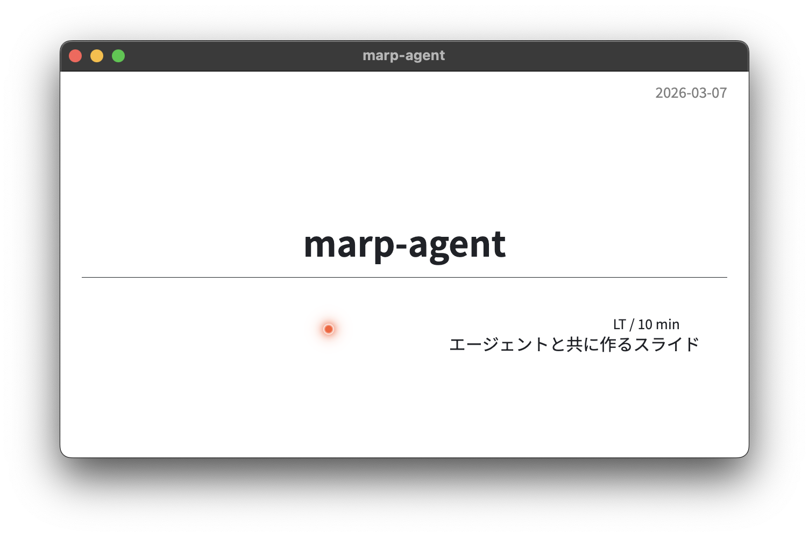

<!-- _paginate: skip -->
<!-- _class: title -->
<!-- _header: 2026-04-07 -->

# MarpAgent

<div class="author">

Markdown で作る, 構造化プレゼンテーション

</div>

---

<!-- _header: Agenda -->

<div class="centered">

1. MarpAgent とは
2. 構造化ワークフロー
3. Lab テーマとレイアウト
4. プレゼンモード & バリデーション
5. AI アシスト & 始め方

</div>

---

<!-- _header: MarpAgent とは -->

## MarpAgent とは

Markdown だけでスライドを作成・検証できるプラットフォーム

- **Marp** ベースの Markdown → スライド変換エンジン
- **構造化ワークフロー**で構成の破綻を防止
- **自動バリデーション**で表示崩れを本番前に検出
- HTML / PDF / PPTX へのエクスポートに対応

<div class="tip">

VS Code 拡張やCLIで使える OSS ツール

</div>

---

<!-- _header: ワークフロー -->

## 構造化ワークフロー

brief → outline → slide の3段階でスライドを作成する

<div style="width: 90%">


```mermaid
graph LR
    A["📝 brief.md"] --> B["📋 outline.md"] --> C["🖥 slide.md"]
    C --> D["HTML / PDF / PPTX"]
```

</div>

- **brief.md** — 対象者, 時間, 核心メッセージ, 禁止パターンを定義
- **outline.md** — brief からスライド構成を自動生成
- **slide.md** — Markdown でスライドを執筆, バリデーション

---

<!-- _header: テーマ -->

## Lab テーマ

<div class="col">
<div>

**カラースキーム (5種)**

Dracula / One Dark Pro / Nord / Neogaia / GitHub Light

**レイアウト**

title / content / multi-column / visual col / metric-grid / timeline / placement utilities

</div>
<div>

**組み込みコンポーネント**

- コールアウト (note / tip / warning ...)
- Mermaid ダイアグラム & MathJax 数式
- コードハイライト

</div>
</div>

---

<!-- _header: レイアウト -->

## Multi-column

<div class="col with-summary">
<div>

### 比較

同じ粒度の観点を横並びにして，差分を一目で追えるようにする

<div class="gap-box">短い結論を置く</div>

</div>
<div>

### 分担

担当・役割・制約など，独立した3要素を等幅で整理する

<div class="gap-box">並列関係を保つ</div>

</div>
<div>

### 選択肢

候補案を増やしすぎず，3択程度に絞って比較する

<div class="gap-box">判断材料にする</div>

</div>
</div>

---

<!-- _header: レイアウト -->

## Visual column

<div class="col visual" style="--visual-left: 1.2; --visual-right: 0.8;">
<figure>

<figcaption>視覚情報を大きく見せる</figcaption>
</figure>
<div>

**読み取り方**

- 左側に図やスクリーンショットを配置
- 右側に観察点と判断を短く置く

<div class="summary-box">図を主役にしたいスライド向け</div>

</div>
</div>

---

<!-- _header: レイアウト -->

## Placement utilities

<div class="col fill">
<div class="place-middle">
<div>

**inline style を減らす**

- `place-middle` で上下中央
- `place-center` で左右中央
- `fill` で下部余白を除いた本文領域を使う
- 列の `div` に `place-middle place-center` で中身を中央配置

<div class="summary-box self-center">配置を class で指定する</div>

</div>
</div>
<div class="place-middle place-center">
<figure>

<figcaption>図と本文の高さが違っても中央で揃える</figcaption>
</figure>
</div>

</div>

---

<!-- _header: レイアウト -->

## Metric grid

数値や結果をカードとして並べ，本文より先に量感を見せる

<div class="metric-grid four">
<div><strong>4</strong><span>追加された標準レイアウト</span></div>
<div><strong>0</strong><span>deck固有CSSなしで使用</span></div>
<div><strong>25.x</strong><span>実行時 Node.js の想定範囲</span></div>
<div><strong>1</strong><span>Markdown を主役に保つ</span></div>
</div>

---

<!-- _header: レイアウト -->

## Timeline

<ol class="timeline">
<li><strong>Brief</strong> 対象者と目的を固定する</li>
<li><strong>Outline</strong> 構成と layout hint を生成する</li>
<li><strong>Slide</strong> Markdown で本文と図を入れる</li>
<li><strong>Validate</strong> 表示崩れを検出して直す</li>
</ol>

<div class="tip">

プロセス説明は箇条書きより，順序を持った横並びのほうが読みやすい

</div>

---

<!-- _header: プレゼンモード -->

## プレゼンモード

<div class="col">
<div>

**発表を支援する機能**

- レーザーポインタ (オレンジカーソル + グロー)
- ライブリロードで編集即反映
- オーバービューモードで全体把握

</div>
<div>

<figure>

<figcaption>レーザーポインタ付きプレゼンモード</figcaption>
</figure>

</div>
</div>

---

<!-- _header: バリデーション -->

## 自動バリデーション

<div class="col">
<div>

**Headless ブラウザで検出**

- オーバーフロー (はみ出し) 検出
- 密集バレット (5個超) の警告
- 長すぎる見出しの検出
- フォント縮小の防止

CI/CD 統合で品質ゲートとして利用可能

</div>
<div>

<figure>

<figcaption>オーバービューで全スライドを一覧</figcaption>
</figure>

</div>
</div>

---

<!-- _header: AI 統合 -->

## AI アシスト

Claude Code スキルで brief 作成からバリデーション修正まで自動化

- **`/slide-new`** — デッキの新規作成 (brief → outline → slide を一気通貫)
- **`/slide-add`** — 既存デッキへのスライド追加
- **`/slide-review`** — バリデーション実行と自動修正

<div class="important">

AIがワークフロー全体をアシストするため, Markdown の記法を覚えるだけで始められる

</div>

---

<!-- _header: 始め方 -->

## 始め方

3つのコマンドで今すぐ始められる

```bash
# 1. デッキを作成
marpx -n decks/my-talk

# 2. brief を埋めてアウトラインを生成
marpx decks/my-talk/brief.md --outline

# 3. スライドを書いてバリデーション
marpx decks/my-talk/slide.md -v
```

<div class="tip">

ライブプレビューは `marpx <slide.md>` で起動
単発 preview は `-p`, overview は `--overview` を付ける

</div>

---

<!-- _paginate: skip -->
<!-- _header: まとめ -->

<div class="centered">

1. **Markdown だけ**で高品質なスライドを作成
2. **brief → outline → slide** で構成の破綻を防止
3. **自動バリデーション**で表示崩れを事前に検出
4. **AI アシスト**でワークフロー全体を効率化

</div>
