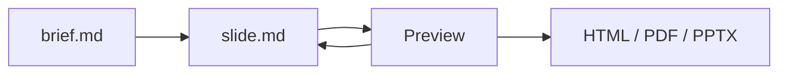
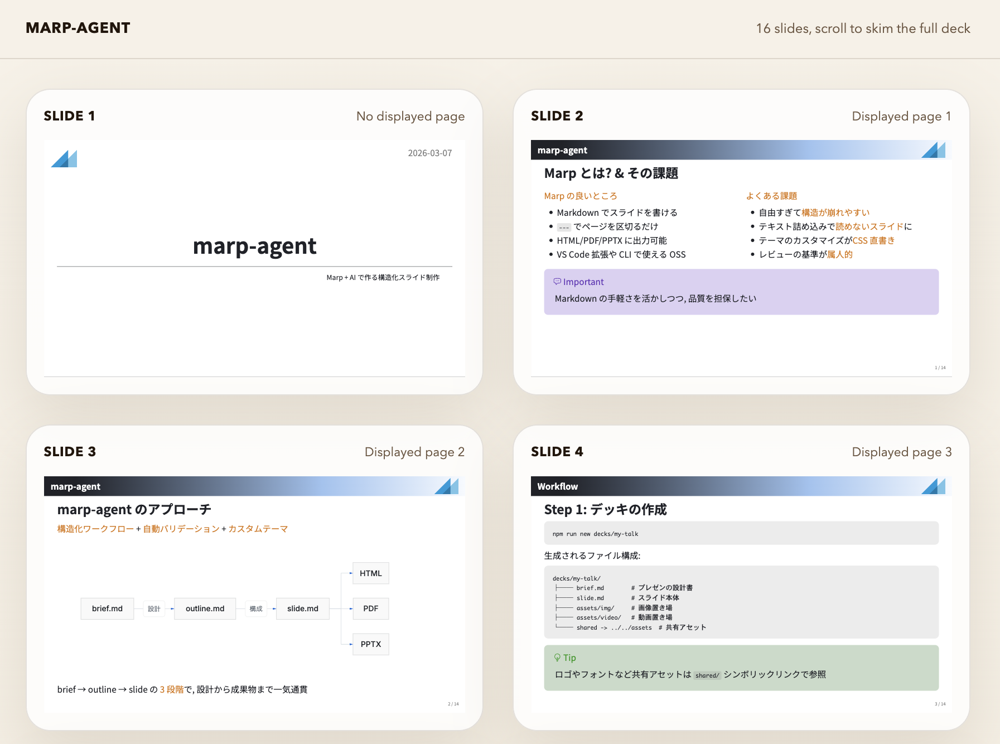
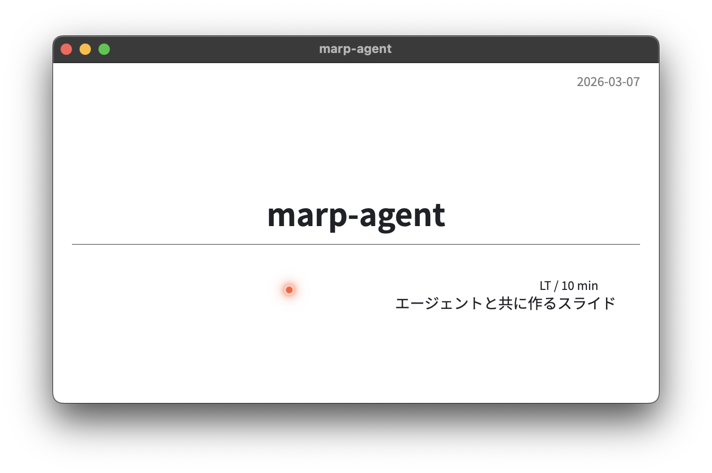

<!-- _paginate: skip -->
<!-- _class: title -->
<!-- _header: 2026-04-07 -->

# MarpAgent

<div class="author">

Markdownで書いて，見て，直す

</div>

---

<!-- _header: Agenda -->

<div class="centered">

1. MarpAgent とは
2. ラフから完成までの進め方
3. Lab テーマとレイアウト
4. プレゼンモード & バリデーション
5. AI アシスト & 始め方

</div>

---

<!-- _header: MarpAgent とは -->

## MarpAgent とは

Markdown だけでスライドを作成・検証できるプラットフォーム

- **Marp** ベースの Markdown → スライド変換エンジン
- **同じ原稿**で構成の検討から改稿まで進める
- **自動バリデーション**で表示崩れを本番前に検出
- HTML / PDF / PPTX へのエクスポートに対応

<div class="tip">

VS Code 拡張やCLIで使える OSS ツール

</div>

---

<!-- _header: ワークフロー -->

## ラフから完成まで，同じ原稿を育てる

重要な図を早めに置き，描画結果を見ながら構成を見直す

<div style="width: 90%">


```mermaid
graph LR
    A["brief.md"] --> B["slide.md"]
    B --> C["Preview"]
    C --> B
    C --> D["HTML / PDF / PPTX"]
```

</div>

- **brief.md** — 目的・対象者・制約・資料を記録する
- **slide.md** — ページ順・本文・図を直接編集する

---

<!-- _header: テーマ -->

## Lab テーマ

<div class="col">
<div>

**カラースキーム (5種)**

Dracula / One Dark Pro / Nord / Neogaia / GitHub Light

**レイアウト**

title / content / multi-column / visual col / metric-grid / timeline / placement utilities

</div>
<div>

**組み込みコンポーネント**

- コールアウト (note / tip / warning ...)
- Mermaid ダイアグラム & MathJax 数式
- コードハイライト

</div>
</div>

---

<!-- _header: レイアウト -->

## Multi-column

<div class="col with-summary">
<div>

### 比較

同じ粒度の観点を横並びにして，差分を一目で追えるようにする

<div class="gap-box">短い結論を置く</div>

</div>
<div>

### 分担

担当・役割・制約など，独立した3要素を等幅で整理する

<div class="gap-box">並列関係を保つ</div>

</div>
<div>

### 選択肢

候補案を増やしすぎず，3択程度に絞って比較する

<div class="gap-box">判断材料にする</div>

</div>
</div>

---

<!-- _header: レイアウト -->

## Visual column

<div class="col visual" style="--visual-left: 1.2; --visual-right: 0.8;">
<figure>

<figcaption>視覚情報を大きく見せる</figcaption>
</figure>
<div>

**読み取り方**

- 左側に図やスクリーンショットを配置
- 右側に観察点と判断を短く置く

<div class="summary-box">図を主役にしたいスライド向け</div>

</div>
</div>

---

<!-- _header: レイアウト -->

## Placement utilities

<div class="col fill">
<div class="place-middle">
<div>

**inline style を減らす**

- `place-middle` で上下中央
- `place-center` で左右中央
- `fill` で下部余白を除いた本文領域を使う
- 列の `div` に `place-middle place-center` で中身を中央配置

<div class="summary-box self-center">配置を class で指定する</div>

</div>
</div>
<div class="place-middle place-center">
<figure>

<figcaption>図と本文の高さが違っても中央で揃える</figcaption>
</figure>
</div>

</div>

---

<!-- _header: レイアウト -->

## Metric grid

数値や結果をカードとして並べ，本文より先に量感を見せる

<div class="metric-grid four">
<div><strong>4</strong><span>追加された標準レイアウト</span></div>
<div><strong>0</strong><span>deck固有CSSなしで使用</span></div>
<div><strong>25.x</strong><span>実行時 Node.js の想定範囲</span></div>
<div><strong>1</strong><span>Markdown を主役に保つ</span></div>
</div>

---

<!-- _header: レイアウト -->

## Timeline

<ol class="timeline">
<li><strong>ラフ</strong> 見出しと材料を並べる</li>
<li><strong>試作</strong> 重要な図を実際に置く</li>
<li><strong>改稿</strong> 描画を見て内容を整える</li>
<li><strong>検証</strong> 流れと表示を確かめる</li>
</ol>

<div class="tip">

各段階で同じ slide.md を編集する．必要なら前の段階に戻る

</div>

---

<!-- _header: プレゼンモード -->

## プレゼンモード

<div class="col">
<div>

**発表を支援する機能**

- レーザーポインタ (オレンジカーソル + グロー)
- ライブリロードで編集即反映
- オーバービューモードで全体把握

</div>
<div>

<figure>

<figcaption>レーザーポインタ付きプレゼンモード</figcaption>
</figure>

</div>
</div>

---

<!-- _header: バリデーション -->

## 自動バリデーション

<div class="col">
<div>

**Headless ブラウザで検出**

- はみ出し・文字の重なりを検出
- 小さすぎる文字や欠落画像を検出
- 箇条書き数などは任意の補助ヒント

根拠と話の流れは読み直して確認する

</div>
<div>

<figure>

<figcaption>オーバービューで全スライドを一覧</figcaption>
</figure>

</div>
</div>

---

<!-- _header: AI 統合 -->

## AI アシスト

エージェントも slide.md を直接編集する

- **`/slide-new`** — ラフから完成まで作成
- **`/slide-edit`** — 構成・本文・図を改稿
- **`/slide-add`** — 既存デッキへのスライド追加
- **`/slide-review`** — 内容と描画を点検し，依頼に応じて修正

---

<!-- _header: 始め方 -->

## 始め方

短いbriefを書き，slide.mdに見出しと材料を置く

```bash
# 1. Create the deck
marpx -n decks/my-talk

# 2. Edit brief.md and slide.md with live preview
marpx decks/my-talk/slide.md

# 3. Validate the rendered deck
marpx decks/my-talk/slide.md -v
```

<div class="tip">

全体の流れを見るときは `--overview` を付ける

</div>

---

<!-- _paginate: skip -->
<!-- _header: まとめ -->

<div class="centered">

1. **Markdown**で本文と図を編集
2. **slide.mdのラフ**を描画しながら育てる
3. **自動バリデーション**で表示崩れを事前に検出
4. **AI アシスト**でワークフロー全体を効率化

</div>
